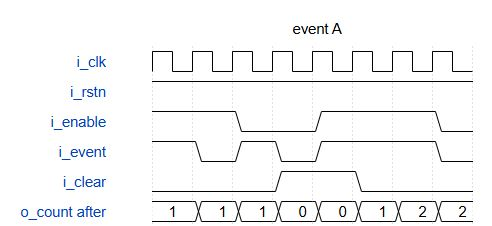
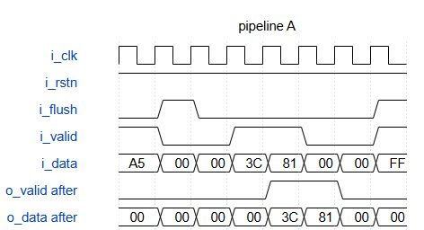

# 两模块 RTL 维护版与公开复现

2026-10-07，本目录的六份维护源码通过严格静态门禁，0错误、0警告。公开版复现入口已经实际运行 `--mode all`，与原版的输出比较全部一致，18份规格产物逐字节重建相同。原实验源码、API结果和v3材料保持原样。

这是一份独立维护版本。A是正确参考，B/C是用于验证工具检出的故意缺陷，不能把B/C的源码风格通过写成其功能正确。模型未使用这些新源码重新评测，原模型成绩不能自动归到维护版。

## 文件与证据

| 入口 | 内容 |
|---|---|
| [targets](targets/) / [originals](originals/) | 六份维护源码及六份冻结原源码 |
| [输入清单](publishable_inputs.json) | 35份必要输入、入口及原项目合同的SHA256 |
| [复现工具](publishable_reproduce.py) | 项目内可搬运入口，gate/spec/semantics/all四种模式 |
| [原验证记录](verification/original-run/final_receipt-r2-complete.json) | 子代理首次36次DUT、失败尝试与限制 |
| [公开重放回执](verification/replay/replay_receipt.json) | 主代理从公开文件实际完成的第二次36次DUT |
| [发布回执](release_receipt.json) | 复制、18份规格重建、分母与边界 |
| [完整原验证包](closed_candidate_attempts.zip) | 623份原绑定文件、原清单及16份后续入口文件，共640成员 |
| [浏览器检查原件](closed_visual_attempts.zip) | 首次与修正后的六图检查，33成员；失败保留 |
| [公开完整重放原件](public_replay.zip) | 新生成物、实际DUT编译/运行、采样、命令、退出码 |
| [独立机器复核](verification/independent-review/review-r2.md) / [收尾回执](verification/independent-review/closure_receipt.json) | 1511项机械检查通过；初审及审核者路径错误原件保留，非H02 |
| [交付完整性清单](delivery_manifest.json) | 本目录最终文件SHA256及外部报告绑定 |

以上原件保留原绝对路径和时间。当前可执行入口从所在项目推导根目录；两份原语义脚本由它明确校验并仅替换八处路径，向量、判据及比较逻辑不变。不能把原日志中的私有路径直接当成另一台机器的运行命令。

## 规格与实际浏览器截图

| 模块 | A正确参考 | B故意缺陷 | C故意缺陷 |
|---|---|---|---|
| 事件累计器 | [规格](spec/targets/event_accumulator/A/event_accumulator_spec.md) / [SVG](spec/targets/event_accumulator/A/waveforms/event_accumulator_variant-behavior.svg) | [规格](spec/targets/event_accumulator/B/event_accumulator_spec.md) / [SVG](spec/targets/event_accumulator/B/waveforms/event_accumulator_variant-behavior.svg) | [规格](spec/targets/event_accumulator/C/event_accumulator_spec.md) / [SVG](spec/targets/event_accumulator/C/waveforms/event_accumulator_variant-behavior.svg) |
| 有效数据流水线 | [规格](spec/targets/valid_data_pipeline/A/valid_data_pipeline_spec.md) / [SVG](spec/targets/valid_data_pipeline/A/waveforms/valid_data_pipeline_variant-behavior.svg) | [规格](spec/targets/valid_data_pipeline/B/valid_data_pipeline_spec.md) / [SVG](spec/targets/valid_data_pipeline/B/waveforms/valid_data_pipeline_variant-behavior.svg) | [规格](spec/targets/valid_data_pipeline/C/valid_data_pipeline_spec.md) / [SVG](spec/targets/valid_data_pipeline/C/waveforms/valid_data_pipeline_variant-behavior.svg) |





六张最终SVG都实际打开并截图查看，记录在[浏览器回执](visual/root_visual_receipt.json)。它们是声明规格的图示，实际仿真证据在原件包内；图示不是覆盖率或形式等价证明。几何诊断含空白字符的潜在越界，原件保留，不宣称零几何警告。

## 复现

先取得完整项目及项目Python依赖，并准备已安装的 `readable-verilog-generator` 技能、Icarus `iverilog/vvp` 和WaveDrom 3.6.1。此入口不会安装软件、读取API凭据或请求模型。

从项目根在PowerShell运行：

```powershell
python -B -X utf8 benchmarks/rtl_style_maintenance_20261007/publishable_reproduce.py --out-dir .tmp-codex/rtl-style-repeat-r2 --mode all --skill-root "$env:USERPROFILE/.codex/skills/readable-verilog-generator"
```

输出目录必须是项目内的新目录；既存目录和发布输入目录会被拒绝。`semantics`会先执行源码门禁；`spec`重建六份规格图，读取完整的三份最终输入。每次实际运行`all`会增加36次DUT执行，要单列为同组向量复测。

本机首次验证36次、公开版完整重放36次，合计72次DUT，均无模型API请求。每次5115项输出值比较全相同；重复比较不视为新的独立样本。正式gate原件六项`passed`，`testbench/toolchain`仍为`not_requested`；另存的真实Icarus执行不回填或改写官方gate。

未执行形式等价、综合、物理时序、硬件或异机复现，也不是真人试用/H02。维护版不覆盖冻结API实验或原素材。
