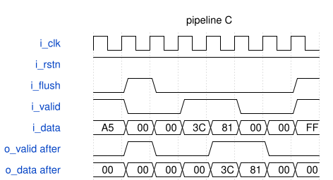

# valid_data_pipeline 模块规范

> RTL: `targets/valid_data_pipeline/C/valid_data_pipeline.v`

## 1. 模块目的

未提供模块目的。

## 2. 参数

| 参数 | 默认值 | 说明 |
| --- | --- | --- |
| — | — | 本模块没有可配置参数。 |

## 3. 时钟与复位

- 时钟：`{"signal": "i_clk", "period_ns": 10, "edge": "posedge"}`
- 复位：`{"signal": "i_rstn", "active_level": 0, "synchronous": false, "assert_cycles": 2}`

## 4. 接口信号规范

| 信号 | 方向 | 位宽 | 时钟域 | 语义角色 | 描述 |
| --- | --- | --- | --- | --- | --- |
| `i_clk` | input | 1 | 未声明 | clock | i_clk |
| `i_rstn` | input | 1 | 未声明 | reset | i_rstn |
| `i_flush` | input | 1 | 未声明 | input_data_or_control | i_flush |
| `i_valid` | input | 1 | 未声明 | input_data_or_control | i_valid |
| `i_data` | input | 8 | 未声明 | input_data_or_control | i_data |
| `o_valid` | output | 1 | 未声明 | output_data_or_control | o_valid |
| `o_data` | output | 8 | 未声明 | output_data_or_control | o_data |

## 5. 周期行为与延迟

- C 原 RTL 的故意错误实现的等语义样式候选；此文档描述实际错误行为，不代表正确功能合同。
- 数据捕获、捕获资格和输出字仍在同步 flush 时清零；输出有效寄存器只在异步复位时清零，正常上升沿直接复制沿前 flag_capture_valid，忽略 i_flush。
- 因此 flush 恰逢第一级存在有效字时，仍可输出 o_valid=1、o_data=0；E1 展示此错误。该失配是必须保留的原故意错误。其余数据路径保留 E0 捕获、E1 输出。

## 6. WaveDrom 时序图

### C 原错误时序

描述 C 原变体及等语义候选的实际逐拍行为；B/C 与 A 的区别是原故意错误，需要在维护中保留。

- WaveJSON：[valid_data_pipeline_variant-behavior.json5](waveforms/valid_data_pipeline_variant-behavior.json5)

## 7. 边界、反压与错误

- 异步复位、flush 与有效输入同拍、连续接受、空泡清零、重新开始。
- 输入和捕获资格为 X/Z 时数据条件采用 default 清零；原直接复制有效标记仍能传播 X/Z。

## 8. CDC 与综合约束

- 固定公开接口、时钟边沿、复位极性及原有寄存器初始化值；不新增状态或可见流水延迟。
- 仅嵌套 plain case，显式匹配已知 1，其余值进入 default，保持原 if 对 X/Z 条件的非真分支语义。清除 X/Z 时仍继续检查后续有效事件或有效数据。
- 四态输入只用于此次候选的差分维护验证；公开正确行为合同的合法输入仍为已知、合法位宽数据。
- 此图是明确声明的行为时序，输出为对应上升沿 after 值；不是实测仿真轨迹。B/C 文件必须保留与正确 A 不同的原语义。

## 9. 验证与验收

- 六个原变体与其候选逐一进行同刺激、全部真实输出差分；记录编译和执行退出码、stdout/stderr。
- A 使用项目原公开逐拍语义判据通过；B/C 在公开判据仍呈现各原故意错误，而且双侧观察与失败位置完全一致。

## 10. 可追溯性

- 规格模块：`valid_data_pipeline`
- RTL 路径：`targets/valid_data_pipeline/C/valid_data_pipeline.v`
- 交付要求：本文档、WaveJSON 和 SVG 必须与同一版本规格一同发布。
