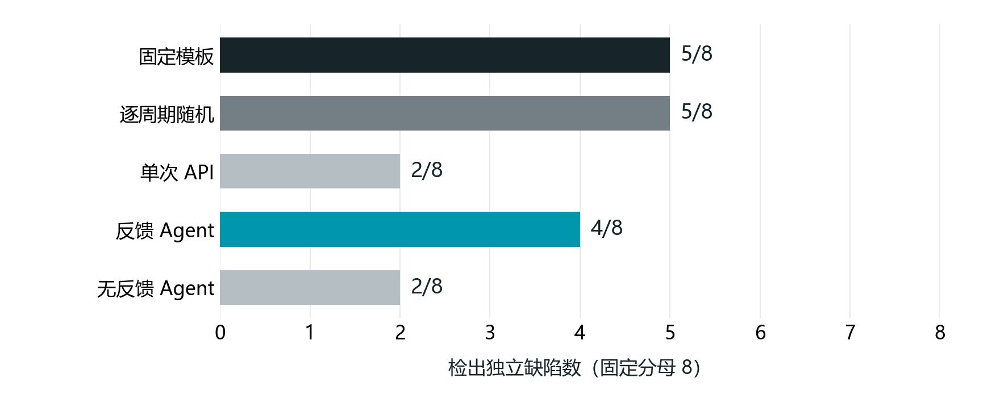

<!-- header: AIC · AI+集成电路 -->
<!-- doctitle: ICARUS / 技术方案（条件稿） -->

# ICARUS 数字 IP 验证智能体

AI+集成电路技术方案

作品名称：ICARUS数字IP验证智能体

应用方向：数字 IP 的 RTL 功能验证与教学实训

材料日期：2026-10-04

## 摘要

ICARUS 面向小型数字模块的功能验证，将第三方模型 API、接口合约、独立参考判据和 Icarus 仿真连接成自动补测流程。模型根据规格和执行摘要提出测试输入，系统检查动作权限与预算后运行真实仿真，保存计划、日志、波形和停止原因。模型不能修改 RTL、参考模型或期望输出。

作品提供网页、命令行和 Python 接口。四类模块的五策略试验保留了全部 60 个样本，使用 52 次真实 API 请求。反馈 Agent 检出 4/8 个缺陷，固定和随机策略各为 5/8；外部有限规格测试检出 13/15 个历史人工变体。最终受测源码完成 914 项回归、1 项跳过，冻结证据包的文件集合和哈希经再次核查一致。

本作品的贡献是将模型建议转化为有独立判据、执行限制和证据记录的验证过程。现有数据支持流程可运行与结果可追溯，尚不足以证明模型普遍提高检出率。

> 版本说明：按用户提出的前提，H01 真人试用、H02 独立人工复核均通过。本稿将这两项保留为明确的条件段落；当前未提供对应人员原始记录，不将其写成已发生事实。其余工程和实验数字均来自已保存的真实记录。

关键词：数字 IP；RTL 验证；模型 API；反馈补测；独立判据；运行证据

<!-- pagebreak -->

## 一、作品概述

### 1.1 问题与背景

数字模块的复位、边界条件、握手和状态转移，往往需要特定输入才能暴露错误。RTL 能够编译、仿真进程能够结束，并不说明这些行为符合规格。若模型同时生成测试输入和期望结果，还可能出现同一理解错误同时进入激励与判据的情况。

ICARUS 将问题限定在设计阶段的模块级功能验证：帮助使用者组织测试输入、执行仿真、理解结论和交接证据。它接入真实 RTL 工具链，不以聊天回答替代仿真结果，也不承担复杂 SoC 验证、物理实现、形式等价证明或制造测试。

### 1.2 目标与使用对象

| 使用对象 | 具体任务 | 工具提供的支持 |
|---|---|---|
| 数字电路学习者 | 验证计数器、FIFO、串行接口等模块 | 可运行案例、规格与结果说明、波形和记录 |
| 小型数字 IP 开发者 | 上传 RTL、设计输入、对比修改前后行为 | 接口确认、API 补测、限定输出比较 |
| 教学与技术复核人员 | 判断结论依据是否充分、接手结果 | 判据来源、停止原因、输入哈希与证据导出 |

目标是降低组织验证过程和复查结果的操作负担，使输入建议、工具执行与技术结论各有依据。是否节省真实人员时间，需由任务计时和原始反馈证明，本稿不填写未经测量的效率百分比。

### 1.3 作品形态与当前完成范围

作品包含 Streamlit 网页、CLI、Python 验证库、内置案例、静态规则和实验脚本。网页保留案例选择、自定义 RTL 上传、验证目标、可选设置、计划生成、仿真与结果展示；命令行提供自动验证、版本比较和证据处理入口。

当前已接通第三方 API 的计划生成及反馈补测；内置独立参考模型覆盖 15 类设计。对于冻结的外部 RTL，另提供先验证基线有限资格、再比较限定输出的适配流程。源码和本地证据均已归档，公开仓库地址及正式报名提交不在本稿中虚构。

<!-- pagebreak -->

## 二、需求分析

### 2.1 需求的实际来源

需求首先来自本项目的开发与验证过程。已有记录显示，保存的计数器输入可使同一个回绕缺陷产生 8 项失败检查；外部 UART 的输入选择会影响位序和停止位问题是否被观察；早期 VCD 采样方法还曾将同一时间戳的最终值误当作采样语句时刻的值。这些事实说明，输入是否有效、判据是否独立、观测时刻是否正确，必须分别检查。

需求分析采用案例实验、失败记录分析和操作任务拆解；真人试用用于进一步确认使用体验，独立人审用于核查规格与结论。后两项按本稿前提写成 H01/H02 条件段，不补造访谈人数或行业调研结论。

### 2.2 需求与验收对应关系

| 需求 | 主要难点 | 实现与验收依据 |
|---|---|---|
| 输入能覆盖有意义的行为 | 自然语言建议可能重复或不符合接口 | 合约约束、合法向量检查、保留旧计划并追加；E03 |
| AI 建议可以独立核对 | 模型自生成期望值不构成可靠判据 | 内置参考模型或明确标注的有限差分；E01、E04 |
| 结论容易区分 | 运行成功、功能失败、证据不足含义不同 | 分列运行状态、检查结果、判据来源与停止原因；E02 |
| 多轮执行可控 | 调用、重复仿真与等待可能持续增长 | 请求、轮数、向量、周期和超时限制；E03、E05 |
| 结果能够交接 | 输入变化或缺少原件可能使旧结论失效 | 输入哈希、独立输出目录、清单和冻结快照；E06 |
| 网页能够完成主要操作 | 上传、长结果和切页状态影响流程 | 三尺寸浏览器操作及实际上传、仿真、返回；E07 |

### 2.3 验收层次

功能验收判断入口、数据流和错误恢复是否符合预定行为；能力评测判断在指定输入和预算下检出了哪些独立缺陷；真人试用判断参与者能否完成分配任务并理解结果；独立人审判断规格、变体、判据和统计是否一致。

这些层次分别保存证据。人审通过不会把外部漏检改写为已检出，网页试用通过也不会自动证明任意 RTL 正确。

<!-- pagebreak -->

## 三、AI 技术工具选择与运用

### 3.1 工具选型与职责

| 工具或模块 | 本项目中的职责 | 选择依据 |
|---|---|---|
| 第三方模型 API，模型 ID 为 deepseek-flash | 理解规格与执行摘要，提出追加输入或停止 | 复用语言与推理能力，保持 API 推理部署方式 |
| Icarus Verilog | 编译 RTL 与测试台，执行仿真 | 接入真实 RTL 执行过程，生成日志与波形 |
| 独立参考模型 / 有限规格测试 | 提供预期行为或核查外部基线资格 | 使结果判断不依赖同一次模型猜测 |
| Python / Pydantic | 状态、数据结构、动作权限和预算校验 | 拒绝不合法动作，记录可解析的执行事实 |
| Streamlit | 案例、上传、运行、结果与档案界面 | 统一同会话状态和工具操作入口 |

本项目没有自研基础模型权重，没有在本机运行开源模型推理，也没有将轨迹导出描述成已完成模型训练。服务商能力与本项目开发的验证逻辑分别列明。

### 3.2 模型输入与动作约束

模型读取人工规格、接口合约、已有计划、最近一轮执行摘要及剩余预算。动作仅有 `append_vectors` 与 `stop`；一次建议最多追加 12 个向量，整个运行还受配置的累计向量和周期上限约束。输入值必须符合端口与合约要求。

模型不得修改 RTL、参考模型、已有向量或期望输出，不得给出 shell 命令或任意执行路径。只有通过结构与权限校验的动作才进入仿真。模型输出不合法、达到输出长度上限或执行出错时，系统保存原因并停止。

### 3.3 模型与判据的分工

内置流程由确定性参考模型提供受支持设计的期望输出；缺少独立判据时，自动循环明确停止。外部流程先用有限规格测试核查冻结基线，再比较候选与基线的限定输出，证据类型为 `qualified_baseline_differential`。

外部差异称为行为差异，不直接称为功能反例；其输出比较数与断言检查数分别统计。API 推理辅助输入搜索，技术结论仍受规格、判据支持范围和已执行输入限制。

<!-- pagebreak -->

## 四、项目实施

### 4.1 系统结构与执行流程

用户确认 RTL、规格和接口后，系统保存输入哈希与初始计划。每一轮将摘要和预算交给 API，校验其动作，生成受控测试台并调用 Icarus。实际输出由独立判据解释，计划、日志、波形和观测记录随轮次保存。

发现反例或行为差异、模型主动停止、预算耗尽、执行出错或证据不足时，循环结束并保留现场。当前 Agent 追加测试输入，不自动修复 RTL；后续反馈主要来自无差异摘要，不能将该流程描述成失败日志驱动的代码修复。

### 4.2 实施阶段与职责

| 阶段 | 完成内容 | 记录范围 |
|---|---|---|
| 验证基础 | 案例、合约、参考模型、测试台与仿真管线 | 历史基准与各层证据 |
| 产品与自动循环 | 网页、CLI、状态保留、API 动作与预算 | E02、单模块联调记录 |
| 效果评测与外部接入 | 四模块五策略 pilot、外部冻结输入与有限差分 | E03、E04、E05 |
| 判据修正与冻结 | 即时采样、输入保持、完整回归及证据包 | E01、E06、E07 |
| 人员验收与提交 | 真人任务、独立人工复核、最终材料核对 | H01/H02 为本稿假设，待真实记录确认 |

技术责任按验证内核、交互与接口、实验和材料管理拆分；实际报名成员与身份以报名系统为准。已验证环境为 Python 3.12.7、Icarus 12.0；模型通过 HTTPS API 使用。本稿不推断已完成异机安装、芯片上板或产业部署。

<!-- pagebreak -->

### 4.3 关键技术与改进型创新

第一，将模型生成输入与结果判断分开。模型只提出候选测试，期望值由独立参考模型提供；外部基线差分使用另一种明确标注的证据类型。这样可以指出结论依据是什么，避免让模型同时为自己的输入生成可信证明。

第二，将自然语言补测变成受控动作。状态机校验向量、权限、重复动作、输入版本和剩余预算，合法建议才进入真实仿真。旧向量随轮次保留，模型不能通过替换输入或更改期望值消除原失败。

第三，区分采样语义和最终波形值。外部适配在实际采样语句之后、下一组输入之前记录即时输出，并保存插桩前后测试台与哈希。早期优先编码器 16 个采样点中有 4 个与旧 VCD 取值不一致，新方法另行验证，旧记录保留。

第四，按实际执行计量。请求失败计入尝试，累计周期包含每轮重放旧计划；外部候选和基线的执行都计入预算。断言、输出样本、独立缺陷、测试用例和人员数量使用不同分母，避免把大量检查记录包装成能力增益。

这些设计构成对通用模型调用的场景化二次开发。贡献在执行架构、判据管理和可复核记录，不宣称新的基础模型算法、业内首创或替代验证工程师。

### 4.4 状态、异常与当前支持边界

网页普通切页和 rerun 保留同会话输入与结果；设计输入变化会清除相关旧页面证据，磁盘原件保留。每次执行使用新目录，API 密钥通过私有配置按需读取，不写入参赛材料。

核心修正 `1c1e0dc` 使未再次列出的输入保持上一值，符合测试台执行语义；内置顺序逻辑的 `before` 采样缺少已支持的独立判据时停止，不勉强给出正确性结论。最终完整回归源码为 `867b8bd`。下面的 pilot 仍是 `e9b7b8a` 冻结结果，未按新判据重测。

API 与仿真设有各自超时，运行时间预算在操作间检查。输出截断、结构校验失败、网络问题和工具错误分别保留；未观测到差异和预算耗尽都不等于完整正确性证明。

<!-- pagebreak -->

## 五、应用成效

### 5.1 四模块五策略真实 API 对照

试验预先固定 FIFO、UART TX、SPI Master、握手模块，每类两个已有缺陷及正确基线；五种策略、一次开发集重复，共 60 个样本。使用同样的累计激励周期上限，但实际采样密度、请求数量和提前停止情况不同。

| 策略 | 检出 / 8 | 缺陷不可判定 | API 请求 | 正确基线假警 |
|---|---:|---:|---:|---:|
| 固定模板 | 5/8 | 0 | 0 | 0 |
| 逐周期随机 | 5/8 | 0 | 0 | 0 |
| 单次 API | 2/8 | 5 | 12 | 1 |
| 反馈 Agent | 4/8 | 0 | 19 | 1 |
| 无反馈 Agent | 2/8 | 3 | 21 | 0 |

实际共 52 次请求，保存用量 234,536 tokens，实付金额未知。反馈组 4/8 高于单次和无反馈的 2/8，低于固定及随机的 5/8；三种 API 策略对 UART 的两个缺陷均为 0/2。正确基线假警、变体参考回放否决与输出失败分别披露，全部预定样本保留。

该结果只支持本次开发集的描述性比较，不能将 4 对 2 强因果归因为反馈，也不能宣称 AI 普遍优于固定输入。原始数据、请求和判据范围见 E03。

<!-- pagebreak -->

### 5.2 外部 RTL 与真实 API 联调

冻结三个外部模块的源码与许可，执行 24 个输入：3 个基线、15 个历史人工功能变体、3 个等价改写、3 个编译失败控制项。差分结果为 15 个不同、6 个一致、3 个不可判定；有限规格测试检出 13/15 个功能变体，UART TX 的分频偏一与 busy 不清除两个变体仍漏检。这是同作者两个仓库的开发材料，不是独立留出集或上游真实缺陷发现，见 E04。

UART RX 的外部 API 联调使用 1 次真实请求、执行 2 轮，累计 782 个双侧激励周期、5,661 tokens。追加前后分别有 547、628 项有效输出比较，差异均为零；候选和基线为相同字节，证明的是接入与执行链可运行。历史位序变体用固定与扩展计划重放，都观察到同一差异，不能将其归功于新增 AI 向量，见 E05。

### 5.3 工程成熟度与交付

| 项目 | 实际结果 | 证据 |
|---|---|---|
| 完整源码回归 | 914 通过、1 跳过、0 失败，227.34 秒 | E01，源码867b8bd |
| 选定功能验收 | 22 项通过；缺失工具退出2、恢复后退出0 | E02 |
| 浏览器操作 | 三尺寸无横向溢出；上传ALU、84/84检查、切页返回保留结果 | E07，手机为视口模拟 |
| 本地证据包 | 41,007文件；41,006项文件哈希一致；6源码归档 | E06 |
| 原登记输入 | 四份快照共424项精确匹配，含重复文件 | E06 |
| 包内源码抽检 | 本机离线执行547项比较、0差异、0API请求 | E06，不是异机复现 |

完整回归与专项检查存在重叠，不累加成新的去重测试总数。哈希一致证明工件完整性，不能单独证明方法有效或模型准确。历史手写测试台的 83/83、规则计划的 76/83、历史在线五轮事后子集的 61/67 分别保留旧范围，不作为本轮反馈 Agent 成绩。

<!-- pagebreak -->

### 5.4 真人试用与独立人工复核（条件段）

**本节仅按“均通过”的假设起草；实际原始记录未提供。** H01 通过的条件是：真实参与者完成其实际分配的任务，能区分运行状态与设计结论，能找到失败或证据不足的依据并交接结果；安装、自定义输入、可选 API 和窄屏操作按实际执行范围登记。帮助、跳过和复测分别保留。

在上述记录得到确认的情况下，应用结论可以写为：工具支持参与者完成所分配的模块验证流程，结果解释与证据导出可用于学习、开发辅助和任务交接。此结论只限实际参与者、任务、环境和版本；不推导无人协助完成率、满意度、节省时间或行业普遍效益。

H02 通过的条件是：真实审核者未参与被审核功能、变体或判据的编写，核对规格、候选差异、有限判据、原始仿真和统计分母，并保留正确、差异和不可判定场景的复核记录。在记录确认后，可表述为指定范围的结果与报告相符，未发现未解决的判据或统计冲突。

人审通过针对证据与结论的一致性，不要求所有缺陷均被检出，更不是工业签核。H01/H02 的人数、时间、记录索引、审核关系、签署和引用授权由真实原件填写；佐证材料提供待补字段，不生成虚构证明。

### 5.5 应用价值与不足

已完成的工程链提供三方面价值：让测试输入可以真正执行，让技术结论能够指出判据来源，让结果可以按版本交接和复查。按 H01/H02 的前提，进一步具备指定任务范围的使用和人工核验支持。

当前不足也很明确：参考模型范围有限，外部资格来自有限测试，模型输出会截断或校验失败；反馈 Agent 没有胜过固定和随机策略，且缺少重复与独立留出评测。没有测得经济收益，本稿不填写降低成本比例、量产收益或替代人工岗位的结论。

首轮 API 接线停止、旧采样问题、早期回归临时目录设置错误以及包后辅助脚本取错字段，均保留原记录。修正后结果使用新目录，既不删除首次失败，也不将辅助脚本问题当作 RTL 缺陷。

<!-- pagebreak -->

## 六、总结与展望

### 6.1 项目总结

ICARUS 已将第三方模型 API 接入数字 IP 的真实验证过程，完成受约束的输入规划、仿真执行、独立判断和反馈补测。实现重点是处理模型输出与硬件验证之间的接口：什么可以执行、依据什么判断、何时停止、怎样保留证据。

工程与实验结果说明该流程可以运行，也显示输入规划仍有局限。单次开发集试验中，反馈 Agent 为 4/8，固定和随机为 5/8；外部有限规格仍有漏检。因此项目以验证辅助工具定位，保留固定测试、人工规格与技术复核的作用。

实践中最重要的经验是：先确定判据和采样语义，再评价模型；先冻结任务与统计分母，再运行比较；将失败和证据不足作为有效结果保存。使用第三方 API 不减少对真实 RTL 执行、判据和实验方法的要求。

### 6.2 后续改进

首先针对 UART 等薄弱场景扩展协议约束和边界输入，完善有限规格与参考模型。然后在当前采样保护版本上重新冻结任务，进行多次重复与独立留出评测，分别比较单次规划、反馈和无反馈策略，披露实际请求、采样密度及累计执行成本。

交互改进以 H01 的真实卡点为依据；技术修正以 H02 的实际意见为依据。后续可研究托管模型优化、形式验证结合和更多仿真后端，但只有获得可重复收益才写为已完成成果。上板、商用签核与产业部署均不属于当前交付承诺。

### 6.3 提交范围

本轮提供技术方案、佐证汇编、报名短文本和提交核对清单。真人条件段及身份字段在原件核实后才能转为事实表述；答辩展示、视频、远程分享与正式报名状态另行核对。评审正文仅使用作品标识，采用匿名版式。

<!-- pagebreak -->

以下为附录

## 七、附录

### 7.1 证据编号与原件索引

| 编号 | 证据 | 项目内位置 |
|---|---|---|
| E01 | 最终完整回归、JUnit与148份源码指纹 | docs/experiment/ic-validation-pdf-final-2026-10-04/ |
| E02 | 22项机器验收与错误恢复 | docs/trial/machine_acceptance_2026-10-04.md |
| E03 | 四模块五策略真实API pilot | docs/experiment/agent_comparison_live_2026-10-04.md |
| E04 | 三模块24输入与有限规格测试 | docs/experiment/external_agent_readiness.md |
| E05 | 外部UART RX真实API与离线重放 | docs/experiment/external_agent_live_2026-10-04.md |
| E06 | 冻结包、字节审计和包内源码抽检 | docs/competition/ic/evidence_pack_2026-10-04.md |
| E07 | 三尺寸浏览器操作、84/84与状态保留 | docs/experiment/ic-validation-2026-10-04/browser/ |
| H01/H02 | 真人试用与独立人审 | 条件项；真实原件未提供 |

### 7.2 代码、模型和许可

核心入口为 `src/iverilog_ai/ai/agent.py`、`ai/provider.py`、`core/reference_model.py`、`core/pipeline.py`、`ui/app.py` 及内置/外部 Agent 脚本。模型通过服务商 API 使用，不附自研模型权重。自研代码采用 Apache-2.0；第三方工具、RTL 与依赖保留各自来源和许可，清单为 `LICENSE`、`NOTICE`、`THIRD_PARTY.md`。

本地冻结包材料提交为 `81114bce`，最终回归源码为 `867b8bd`；本稿产生于冻结包之后，另行本地提交，不覆盖旧包。源码归档的换行属性与原 Windows 登记字节分别说明；复放时使用对应提交和原输入快照。安装和运行参照项目复核指南，API 重跑需自备凭据和预算。

### 7.3 参考依据

1. AIC 官方主题赛通知及附件1规则、附件2大纲：https://www.aicomp.cn/notice/4756.html，查阅于2026-10-04。
2. 项目指标总账与试验协议：`docs/experiment/metric_inventory.md`、`docs/experiment/agent_comparison_protocol.md`。
3. 外部RTL：alexforencich/verilog-uart、verilog-axi；上游版本、字节和MIT许可见冻结清单。
