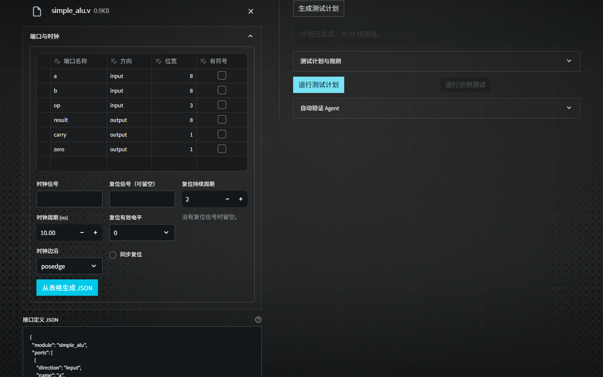

<!-- header: ICARUS · Verification Evidence / 验证佐证 -->
<!-- doctitle: 佐证材料 · 条件稿 -->

# ICARUS数字IP验证智能体
# 佐证材料（条件稿）

材料日期：2026-10-04

**本稿的机器实验为已发生事实；真人试用和独立人工复核仅按用户设定作条件性陈述，待真实原始记录确认。两项假设不得直接作为已经发生的参赛事实提交。**

## 证据目录与适用范围

| 编号 | 证据 | 状态 |
|---|---|---|
| E01/E02/E07 | 工程回归、机器功能验收与浏览器 | 已实测 |
| E03 | 四类模块、五策略真实API pilot | 已实测，单次开发集 |
| E04/E05 | 外部有限规格与真实API联调 | 已实测，历史变体与接线 |
| E06 | 本地证据包及字节审计 | 已完成，非独立人审 |
| H01/H02 | 真人试用与独立人工复核通过 | 假设条件，待原件 |

## E02　机器功能验收

本机执行选定UI与CLI测试，22项通过、0失败、0跳过；另实际运行工具缺失和恢复，退出码分别为2、0。覆盖导航、结果保持、证据导出、波形、计划执行、差分、输入错误及CLI流程。285份产物指纹核对一致。

这些是机器测试数量，不是试用人数。该批产物未完整冻结全部被测源码，不单独证明最终提交已通过同样验收。

出处：[机器功能验收记录](../../trial/machine_acceptance_2026-10-04.md)。

## E01　最终源码工程回归

最终受测源码 `867b8bd`：**914 passed / 1 skipped / 0 failed，227.34秒**。148份源码及配置指纹结束时无变化；mypy检查72个源码文件无错误。跳过项为推荐断言表为空，不计为通过。

E02及各模块测试可能包含在全仓范围内，不将通过数相加。原60行API实验属于 `e9b7b8a`，后续采样保护和排版修正没有重跑该实验。

出处：[最终验证记录第六节](../../experiment/ic_validation_2026-10-04.md)、[最终回归数据](../../experiment/ic-validation-pdf-final-2026-10-04/validation.json)。

<!-- pagebreak -->

## E07　实际浏览器工作流

使用Edge打开本机应用，分别检查1440×900、1920×1080桌面视口和390×844手机模拟视口，未检测到横向溢出。手机宽度是桌面浏览器模拟，不是实体手机验收。

实际上传既有 `simple_alu.v`，校验接口、离线生成28组向量并执行Icarus，**84/84项实际比对一致**；进入设置后返回工作台，上传文件、计划和结果仍保留。该过程没有真实用户参与，不代表真人操作耗时或满意度。

图E07-1：真实浏览器视口截图。采用离线规划器、真实Icarus执行；图片只展示当时可见区域，不代表全部页面功能已逐项验收。

出处：[浏览器操作记录](../../experiment/ic_validation_2026-10-04.md)、[机器检查JSON](../../experiment/ic-validation-2026-10-04/browser/results.json)。

<!-- pagebreak -->

## E03　多模块真实API对照

冻结版本 `e9b7b8a`；FIFO、UART TX、SPI和握手模块各选2个既有缺陷及正确基线，五策略各一次，共60行，固定缺陷分母8。实际API请求52次，已记录总用量234,536 tokens，费用未取得账单。完整保留错误、不可判定和未检出，冻结输入变化列表为空。

| 策略 | 检出/分母 | 未检出 | 不可判定/未完成 | API请求 |
|---|---:|---:|---:|---:|
| 固定模板 | 5/8 | 3 | 0 | 0 |
| 逐周期随机 | 5/8 | 3 | 0 | 0 |
| 单次API | 2/8 | 1 | 5 | 12 |
| 反馈Agent | 4/8 | 4 | 0 | 19 |
| 无反馈Agent | 2/8 | 3 | 3 | 21 |

表中检出与不可判定按缺陷样本统计；请求包含正确基线任务。反馈组仍出现正确基线的截断和假警，不可因缺陷不可判定为0而写成完全无失败。

本次反馈Agent未胜过固定和随机；4/8与2/8的差异只是一次开发集观察。三个API策略对UART的两个缺陷均未检出。各策略共享累计激励周期上限，但实际消耗及采样密度不同，不据此声称反馈的普遍因果增益。发现反例即停止，没有执行RTL自动修复。

当前源码已修正顺序逻辑before判据及输入保持语义；原实验未重新执行，其历史假警和漏检原样保留。

出处：[完整实验报告](../../experiment/agent_comparison_live_2026-10-04.md)、[60行重算摘要](../../experiment/agent-comparison-chat-2026-10-04/summary.json)。

### 失败记录保留

此前首轮因接线配置问题主动停止，60行原件另存，不与本轮拼接。已记录7份响应、51,433 tokens，另有一次可能在途调用用量未知；观察到截断及JSON校验失败，不能证明协议差异是所有错误的唯一原因。

出处：[首轮停止记录](../../experiment/agent_comparison_interrupted_2026-10-04.md)。

<!-- pagebreak -->

## E04　外部RTL重放

UART RX、UART TX和优先编码器共24个输入：3基线、15历史人工变体、3历史等价改写、3编译失败输入。差分结果为15 different、6 identical、3 inconclusive。有限规格测试检出13/15变体，仍漏检UART TX的prescale偏差与busy不清除两个变体。

差分不是形式等价或规格正确性证明，人工变体不是上游真实缺陷。这些模块已参与开发分析，不属于独立留出集。

出处：[外部冻结重放记录](../../experiment/external_agent_readiness.md)。

## E05　外部UART RX真实API联调

采用修复后的即时采样快照。**1次API请求、2轮真实双侧仿真、782累计激励周期、5,661 tokens**。固定计划547个有效输出比较，追加4个向量后628个比较，两轮0差异；候选与基线为相同冻结字节，只证明接线和执行一致性。

另将固定与扩展计划离线用于既有位序变体，两者均在同一点观察到数据150与105的差异。原固定计划已能检出，不能归功新增AI向量。达到轮数上限不证明完整正确性，比较数也不是断言数或缺陷数。

出处：[真实外部联调记录](../../experiment/external_agent_live_2026-10-04.md)、[原始工件指纹摘要](../../experiment/external-agent-live-2026-10-04/summary.json)。

## E06　本地证据包

包含**41,007个文件**，其中41,006项有逐文件SHA-256，另1项为manifest自身；包含6份源码快照和4组共424份注册输入快照，后者含跨快照重复文件。代理逐项复算，集合、长度和SHA与清单一致。

Git归档与Windows注册字节分别保存；36处源码归档与Git blob的差异已解释为CRLF转换。此项为有作者关系的代理审计，不是独立人工认证。本条件稿是包后新增文件，不宣称已收录于既有冻结包；正式提交前另做匿名性与材料集合检查。

出处：[证据包回执与入口](evidence_pack_2026-10-04.md)、[包后代理审计](../../review/ic_pack_review_2026-10-04.md)。

<!-- pagebreak -->

## H01　真人试用条件段

**条件段：按用户假设均通过，待真实原始记录确认。**

通过条件：真实使用者在指定版本完成所分配任务，能够解释通过、差异和证据不足；任务执行、提示协助、失败及复测均有原件。匿名引用须经本人授权，记录与实际运行证据对应。

若上述条件由真实原件确认，可采用以下定性结论：

“在已记录的参与者与任务范围内，使用者完成了约定操作，能够理解主要结果并找到复核证据。结论仅适用于该版本和任务，不外推到所有用户。”

当前没有据此填写人数、原话、满意度、耗时、完成率或用户身份。机器验收E01、E02及E07不替代本项。

准备材料：[真人试用任务与记录方法](../../trial/README.md)。

## H02　独立人工复核条件段

**条件段：按用户假设均通过，待真实原始记录确认。**

通过条件：真实审核者未参与对应功能、变体或判据编写，并披露开发关系；核对规格、输入、判据来源和版本，重放样本，核验分母与失败，保留异议和确认。若参与对应开发，只能称内部复核。须有真实记录，不由代理代签。

若条件经原件确认，可采用以下定性结论：

“在约定审核范围内，规格、运行证据和报告结论相互对应，未发现未解释的不一致。仍保留有限采样、开发集及参考判据范围等限制。”

该结论不等同于工业签核、认证机构鉴定或全部设计正确性证明。代理交叉检查不替代独立人工复核。

准备材料：[独立复核指南](../../review/independent_review_guide.md)。

## 原始记录待补表

| 条件证据 | 待补原件 | 当前状态 |
|---|---|---|
| H01 真人试用 | 真实任务分配、版本、操作记录、反馈原件及授权 | 待提供与核验 |
| H02 独立人审 | 实际审核范围、关系披露、重放证据、异议与确认 | 待提供与核验 |
| 两项共同核对 | 真实日期、原件位置、公开脱敏与结论对应 | 待提供与核验 |

确认前，H01、H02只能作为条件稿保留；不能去掉假设标识，将通过条件改写成已发生事实。
