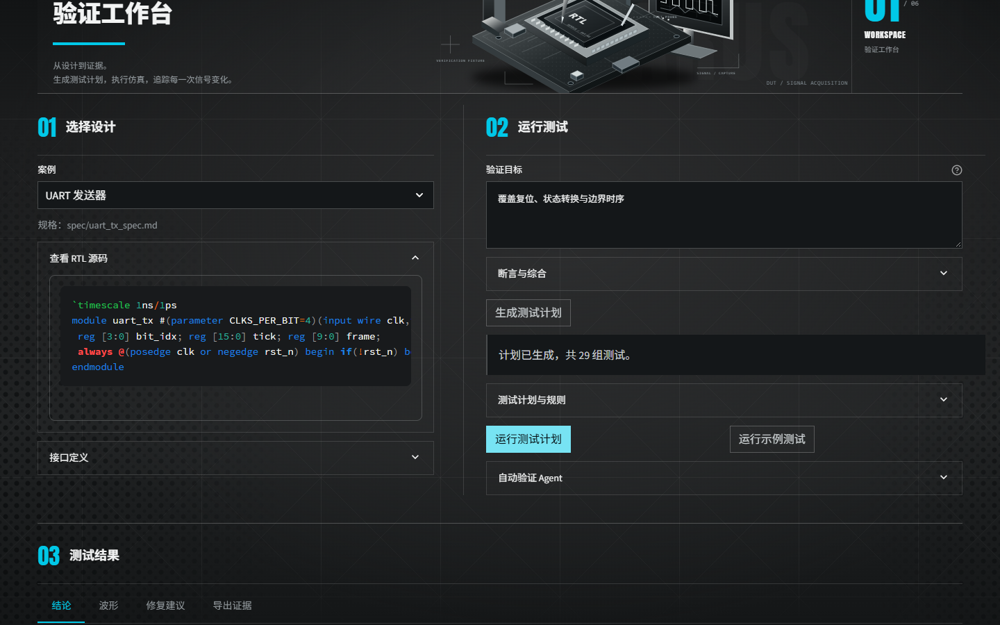

<!-- header: ICARUS · Verification Evidence / 验证佐证 -->
<!-- doctitle: 数字IP验证智能体 / 佐证材料 -->

# ICARUS数字IP验证智能体

佐证材料 · 2026-10-04

## 1. 证据目录与真实性边界

本汇编仅陈述已保存的机器实验与工程事实。H01真人试用、H02独立人工复核均待真实原始记录；没有按假设填写人数、签名或通过成绩。编号V01–V06用于本次v2材料，旧条件稿保留但不作为本稿事实依据。

| 编号 | 证据 | 实际结果 | 不是何种证明 |
|---|---|---|---|
| V01 | 全回归与浏览器r3 | 1073通过/2跳过；三尺寸可用 | 真人满意度或实体手机测试 |
| V02 | 独立协议与人工SPEC | FIFO修复后0差异；外部15/15 | AI发现15个上游真实缺陷 |
| V03 | c7三次重复API | 252行、157请求 | 新版本重复成绩或普遍增益 |
| V04 | v4单次API烟测 | 84行、94请求、1执行失败 | 全任务通过或覆盖因果 |
| V05 | 有限功能场景 | 四配置24项，证据绑定 | RTL代码覆盖或形式证明 |
| V06 | 离线反例重放 | 338比较、48不一致、0API | 异机真人验收 |

受测生产源码提交`28be1edc8b84067912e2034567a8e8a5803b8184`。运行时文档可能有未提交改动，不宣称整个工作区干净；复现依据提交和注册字节SHA，材料另行归档。全仓验证冻结291项源码/配置前后无变化；单项对照实验冻结74项代码/输入。

原始记录可区分为：完整results和逐轮原件、另存summary、便于材料引用的薄receipt。receipt不是完整实验原件，不能单凭它重放全部实验。原件位置与SHA见V03/V04文档；最终归档状态另见本目录README，不预填打包成功。

### H01/H02原始记录待补表

| 项目 | 所需原件 | 当前状态 |
|---|---|---|
| H01真人试用 | 经授权的任务分配、屏幕或操作记录、用时、求助、完成/失败/未知 | 未提供 |
| H02独立人工复核 | 非对应功能/变体/判据编写者的范围声明、原件核验与意见、问题闭环 | 未提供 |

机器操作人数为0。代理交叉检查可发现实现问题，但不填入H02真人审核。

<!-- pagebreak -->

## 2. V01/V06：可运行与可交接

### 工程和网页验收

[全回归记录](../../../experiment/ic_agent_v4_validation_2026-10-04.md)保存原始pytest/JUnit、mypy及文件校验日志：1073 passed、2 skipped、0 failed，187.031秒。跳过为原空断言列表与Windows符号链接权限限制，均未按通过计。mypy检查76个源文件；BOM检查0问题。测试项不是用户或独立样本人数。

实际通过的浏览器批次为r3：1440×900、1920×1080、390×844均无横向溢出；功能覆盖控件已启用；UART离线结果58/58一致，切页后保留。思考模式显示自动、实际配置disabled，全程0API。手机仅为视口模拟。r1/r2定位或旧服务失败目录保留；validation.json历史browser_record原路径不改，由说明单列r3通过原件。

### 零API反例交接

[UART演练](../../../demo/ic_agent_v2_walkthrough.md)使用协议随机，512周期下正确UART338比较/0差异；MSB变体338比较/48差异；busy不释放变体338比较/136差异。每计划均独立参考审核。对MSB变体导出包后，包内`replay.py`再次得到338比较/48差异，0API；退出成功不掩盖设计`failed_checks`结论。原件、生成TB和哈希均随包保存。

<!-- pagebreak -->

## 3. V02/V05：规格、判据与真实功能场景

### 独立FIFO规格

旧RTL和参考模型同拍接受读写均把count减1，相互一致仍违背队列语义。[独立deque检查](../../../experiment/protocol_oracle_improvements_2026-10-04.md)按边沿前占用量决定接受，不复制RTL寄存器结构。

| 控制项 | 周期 | 输出比较 | 差异 |
|---|---:|---:|---:|
| 修复前基线原件 | 76 | 228 | 66 |
| 修复后正确基线 | 76 | 228 | 0 |
| 新full_off_by_one单点变体 | 76 | 228 | 56 |
| 新write_when_full单点变体 | 76 | 228 | 46 |

修复后同拍均接受时count净0，空满边界仍按边沿前状态。旧变体文件不改；v2从新基线施加原operator，避免混入共享旧计数问题。结果属于规格纠错，不归因模型搜索。

### 外部人工SPEC补全

外部24输入包含3基线、15人工变体、3等价改写、3编译失败控制。同字节输入在UART位窗口、busy释放与ready恢复判据补全后，SPEC由13/15至15/15；3基线、3等价项无误报，3编译失败仍不可判定。verify-diff始终为15不同、6一致、3不可判定。外部输入SHA前后不变。

这是有限人工判据增强，不是AI新增向量检出，也不是独立留出集。输入来自同作者两个仓库，来源和许可见冻结manifest。

### 24项有限功能场景

[覆盖定义](../../../experiment/functional_coverage_2026-10-04.md)中FIFO7项、UART6项、SPI6项、握手5项。真实逐周期样本与进程stdout、输入文件SHA绑定；缺失、X/Z或不支持参数不强行给命中。请求尝试与实际接受分开，完整UART帧需连续41拍。覆盖不是断言或正确性结论，不同轮重复观察不算新场景。

<!-- pagebreak -->

## 4. V03：c7版本三次重复原样保留

版本`c7bb280a1d884db90bd35e89e17142b42b7ca80c`，提示词v3；252行、157请求、289219 tokens，全部已知usage有记录，费用未知。冻结输入变化为空。下表每格分母8，原始失败不删除。

表中“无覆盖反馈”对应策略ID `feedback_no_coverage`。

| 策略 | 重复0 | 重复1 | 重复2 | 平均率 |
|---|---:|---:|---:|---:|
| fixed | 7/8 | 7/8 | 7/8 | 87.50% |
| random | 8/8 | 8/8 | 8/8 | 100% |
| single | 1/8 | 0/8 | 2/8 | 12.50% |
| feedback | 1/8 | 0/8 | 0/8 | 4.17% |
| no_feedback | 3/8 | 0/8 | 0/8 | 12.50% |
| protocol_random | 8/8 | 8/8 | 8/8 | 100% |
| 无覆盖反馈 | 0/8 | 0/8 | 0/8 | 0% |

137次决策被schema拒绝、20次通过；125行无round。严格整轮资格为false，但252行和所有缺陷分母保留。终态76检出、39未检出、137 policy_error。API策略未胜本地基线；没有把失败删去后发布成功率。

完整统计、不同缺陷并集、重复范围和首反例条件值见[V03原始分析](../../../experiment/agent_comparison_v2_live_2026-10-04.md)。结果与旧e9 pilot、v4单次烟测分别展示，不绘制同条件提升曲线。

| 完整文件 | SHA256 |
|---|---|
| c7 results.json | `15cc303d7a7b6f462c5394b4cb5f36606127709d0e71fc65058f0fc1f3251c01` |
| c7 summary.json | `a5950aa095ae6846a7ab60b4fe2f941c066c22793b914cdb9bd6e59b0b4132a2` |

原件SHA验证的是记录一致性，不等于第三方认证。

<!-- pagebreak -->

## 5. V04：v4单次烟测与限制

版本`28be1ed`，typed-decisions v4；单次重复84行，94请求/120上限、201710 tokens，unknown usage为0。94/94动作schema通过；这一比例不等于任务完成率或检出率。

| 策略 | 检出/缺陷 | 请求 | total tokens |
|---|---:|---:|---:|
| fixed | 7/8 | 0 | — |
| random | 8/8 | 0 | — |
| single | 2/8 | 12 | 22500 |
| feedback | 6/8 | 29 | 69049 |
| no_feedback | 7/8 | 27 | 56239 |
| protocol_random | 8/8 | 0 | — |
| 无覆盖反馈 | 5/8 | 26 | 53922 |

84行终态43检出、40未检出、1执行失败。正确UART/single任务报TestbenchGenerationError且0round；该任务不作为正确通过。因此严格整轮资格false，所有行仍保留。已审核参考假警与否决均0，不外推失败正确基线。

覆盖反馈6/8、无覆盖5/8、无反馈7/8是一次开发集观察，尚无重复稳定性或因果证明。当前实际作用是消息/动作格式接通和结果可核，并未超过本地基线。详细统计和原件路径见[V04记录](../../../experiment/agent_comparison_v4_smoke_2026-10-04.md)。

| 完整文件 | SHA256 |
|---|---|
| v4 results.json | `c46df250acfd2a665da204139b5b3beed7f6bba48dee847e26d2a052743b908d` |
| v4 summary.json | `ca088434fd908b125df078b3a1f2d7672d04e2fb4da2417de5d8565df401a81a` |

首反例物理墙钟时刻没有证据，保持null；结果实际可获得时间单列。费用无账单不填实付。后续需对新版本重复评估、独立模块留出、真实用户任务与非实现者人工复核；这些工作未完成，不作为现有成绩。
