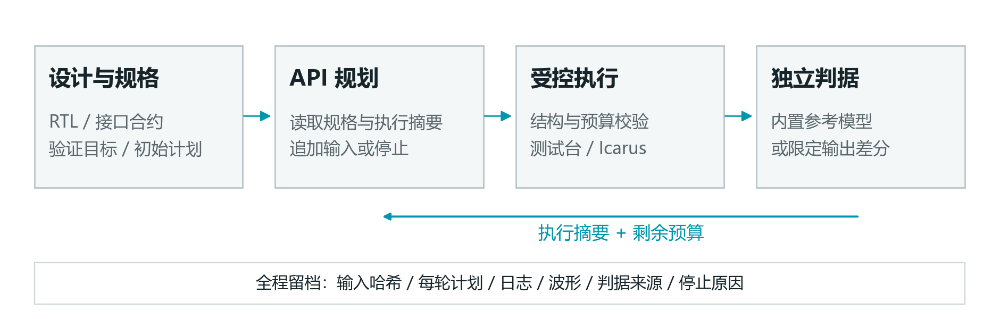
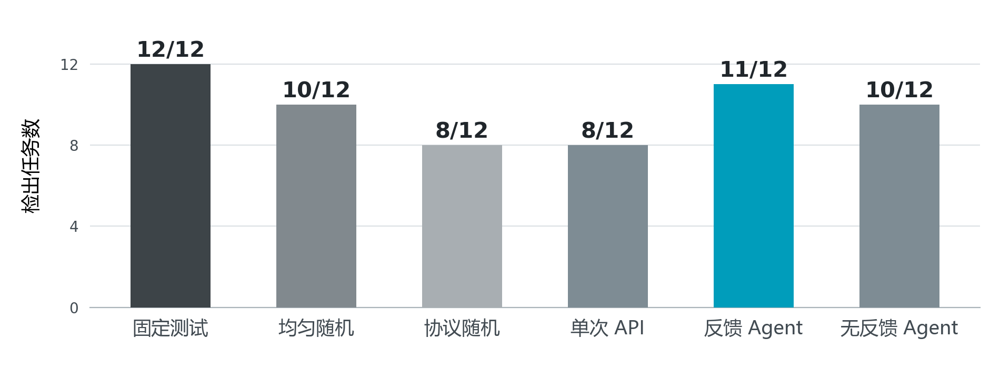

<!-- header: ICARUS · AI+集成电路 -->
<!-- doctitle: 数字IP验证智能体 / 技术方案 v3 -->

# ICARUS数字IP验证智能体

技术方案 · v3 · 2026-10-05

## 一、作品概述

ICARUS面向数字IP开发中的模块级功能验证，把自然语言规格、API测试规划与真实Verilog仿真接成可复查的工作流程。使用者选择案例或上传RTL，说明验证目标并提供接口合约；Agent提出受约束的激励计划，独立参考模型与Icarus Verilog逐拍判定，保存反例、失败原因、原始响应及用量。

作品使用DeepSeek API，不训练或部署本地模型权重。模型负责提出测试，执行器负责校验和运行，判据负责给出结论。可运行的接口、完整错误记录、共享额度和离线交接是本作品的主要贡献。



图1展示职责分工。当前受控实验的补测计划均以新episode执行并自动复位；上一轮电路状态不会延续到下一轮。历史计划保存在轨迹中，供模型规划和审核。

### 1.1 本版实证摘要

| 范围 | 已取得的结果 |
|---|---|
| 两个内部合成新模块 | 108任务全部实际执行，134轮、268实际与正确参考执行侧 |
| 缺陷比较 | 四个不同人工缺陷各重复三次；反馈11/12、随机10/12、固定12/12 |
| 正确控制 | 六策略共36/36实际执行，误报0 |
| API及用量 | 87请求，339624输入加输出tokens，未知与待结算均0 |

本版事实来自封存的[共享数据](material_data.json)及原始回执。最新实验实际源码为`20400fa`，Agent、端口反馈helper和系统提示保持此前`a969337`的冻结字节。材料制作没有新增模型请求或仿真成绩。

<!-- pagebreak -->

## 二、需求分析

### 2.1 从学习与开发任务出发

数字IP的功能错误往往来自边界和多输入交互：缓存空满时的请求是否接受、有效数据遇到清空时如何处理、事件累计何时清零，以及一次操作需要观察多少拍。只看一段波形或少量最终输出，容易漏掉中间状态；测试失败后，需求、激励与判断依据又常散落在不同文件中。

本作品从自身学习和研发中的上述问题提出需求，面向正在编写模块测试的学习者和开发者。需求分析不使用虚构访谈、人员反馈或经济收益。目标是让测试建议可执行、结果可解释、失败可交接。

| 实际任务 | 所需能力 | 本作品的对应实现 |
|---|---|---|
| 把自然语言需求变成输入 | 明确端口、宽度与协议约束 | 规格文本、DutContract与严格TestPlan |
| 探索边界和多周期路径 | 控制激励长度，观察过程 | 受限API规划、独立补测、逐拍采样 |
| 区分工具失败与设计反例 | 分层记录判定 | 格式、预检、执行、输出差异分别留存 |
| 重现并交给他人复核 | 保留原输入与工具证据 | SHA绑定、日志、波形及离线证据包 |

### 2.2 用户操作与验收目标

网页提供案例选择、自定义RTL上传、验证目标、计划生成、仿真、规则审查和运行档案。操作成功应留下明确的计划及实际结果；失败应说明停止阶段，并保留已执行部分。切换页面和同会话rerun应保留输入与结果，长输出可以正常阅读。

对验证能力采用实际正确控制与人工语义变体比较；对交接能力检查输入原字节、执行记录和归档一致性；对使用效果区分机器操作、真实人员反馈及外部部署。当前成绩以内部模块实验和本机工程验收为依据。

<!-- pagebreak -->

## 三、AI技术工具选择与运用

### 3.1 API规划与工具裁决

本次使用DeepSeek接口记录中的`deepseek-flash`模型，对应本次用户选择“4.1f”。服务商完成模型推理，本机运行测试台生成、Icarus编译仿真、独立参考与证据管理。模型不生成裁决用的期望输出，也不直接执行任意程序。

系统规则与用户状态分开传递。模型状态包含正确规格、明确合约、可驱动输入、历史计划、自身剩余额度及策略允许的反馈。内部实验不向模型提供目标RTL、缺陷标签、私有见证、参考源码或旧成绩。

| 层次 | 输入与职责 | 输出 |
|---|---|---|
| API Agent | 读取规格与当前状态，提出激励或停止 | 严格动作结构：action、reason、vectors |
| 计划校验器 | 检查名称、数值、宽度、时钟、采样与预算 | 可执行计划或固定错误码 |
| 执行器 | 生成测试台，运行Icarus，捕获端口 | 真实日志、波形、采样和执行状态 |
| 独立判据 | 按正确规格逐拍复算输出 | 检出、未检出或证据不足 |

### 3.2 受限恢复与共享用量

普通格式错误和可恢复的计划预算错误，只有在请求额度允许时才能重新提案。错误动作不会被静默裁剪或执行；原始响应、拒绝原因与用量仍保存。预检错误反馈采用固定安全代码和受信字段，不回传任意源码或异常原文。

本次完整批次所有API组共享100万输入加输出tokens，最大输出4096tokens，请求非流式、thinking disabled、超时60秒，自动传输重试为0。格式拒绝与预算拒绝后的重新提案是新的收费请求。缺少usage时保留预留额度，不能据空记录把未知消耗当零；缓存字段不重复相加。

作品使用轨迹来审核模型行为，没有对这些轨迹进行权重训练。API凭据在使用者本机私下配置，不随材料或证据包发布。

<!-- pagebreak -->

## 四、项目实施

### 4.1 从合约到实际每拍输出

实现由网页/命令行入口、Agent调度、测试计划校验、测试台生成、Icarus执行、参考判据和证据导出组成。合约明确时钟、复位、端口方向与位宽；测试计划只驱动允许的输入，时钟由工具生成。

当前比较使用独立episode：每个合法新计划重新建立DUT、自动复位，然后按计划施加刺激。一个输入段持续多拍时，工具在每一拍边沿之后检查全部真实输出；不会只比较段末而遗漏中间差异。刺激周期累计受限，正确参考的审核执行侧另列，不混成模型搜索次数。

两类新模块只在固定完整合约上取得权威参考：无参数、固定端口、10ns上升沿时钟、异步低有效复位且自动复位两拍。错误位宽、额外端口、改变复位或时钟、before采样和未知输入不能获得这套参考的授权。旧模块支持范围保持原有门禁。

### 4.2 可用反馈来自真实执行

通用端口摘要读取明确合约中的真实端口，保留完整位串及X/Z，按端点与均匀间隔确定最多12个时间样本，并给出省略数量。它不读取期望值、不推测内部状态、不按最能暴露缺陷的位置选择样本。

摘要交叉绑定计划、合约、RTL、测试台与已保存的执行记录，重解析stdout并核对采样包。缺工件、内容错配、采样缺行、顺序冲突或未完成执行，返回证据不足和安全错误码，不补造端口值。这是本地来源一致性检查；如果所有相关原件同时被伪造，本地SHA不能独立证明真实性。

新两模块有80轮完整端口摘要，实际20个收费请求收到了端口反馈。无反馈策略的31次请求不接收观察和拒绝诊断，但仍知道自身计划、预算并受执行器早停影响。

<!-- pagebreak -->

### 4.3 正确规格与独立判据

| 新模块 | 固定正确行为 | 共同计划限制 |
|---|---|---|
| 两级有效数据流水 | 8位数据，连续有效输入、空泡、flush优先；无效输出数据清零 | 每任务累计24刺激拍，每提案最多12输入段 |
| 许可事件累计器 | 4位模16累计；仅许可事件增加，clear不受enable限制且优先 | 累计接受最多64向量，最多3共享请求 |

状态默认保持输入，独立episode自动复位。single策略仅1请求；反馈和无反馈最多3请求，格式拒绝也占请求。参考模型采用与RTL寄存器实现不同的语义表达，再用真实逐拍输出对齐。

原四类开发配置另有24项有限功能场景：FIFO7、UART6、SPI6、握手5。它们来自真实采样规则，是有限事件观察，不是代码覆盖率或正确性证明。两类新模块没有新增定制bins，其功能覆盖状态为unsupported/unknown。

### 4.4 先检查判据自身

FIFO曾在同拍接受读写时出现占用量错误。独立队列按边沿前空满条件决定接受，队列长度在同时接受时保持不变；它未复制RTL的计数赋值顺序。在76刺激拍、228输出比较中，修复前66项差异，修复后0。修正基线和重新产生的单点变体均独立保存。

外部有限规格补齐UART位持续时间及busy释放检查后，同字节24目标中的15个人工变体检出由13提升到15。三正确、三等价改写无误报，三编译失败保持不可判定。收益来自人工补判据，范围包括三个外部模块类别，不记为AI新增发现。[判据原件](../../../experiment/protocol_oracle_improvements_2026-10-04.md)

<!-- pagebreak -->

## 五、应用成效

### 5.1 最新两模块完整受控批次

Agent、helper与系统提示先冻结于`a969337`，再加入两类新合成模块和独立参考适配；实际执行源码为`20400fa`。每模块正确目标与两个语义变体，三次重复、六策略，共108任务。每策略分母为四个不同人工缺陷各重复三次，即12缺陷任务，另有6正确控制。



| 策略 | 检出/12 | 三次检出各/4 | API请求 |
|---|---:|---|---:|
| 固定测试 | 12 | 4/4/4 | 0 |
| 均匀随机 | 10 | 4/3/3 | 0 |
| 协议随机 | 8 | 4/2/2 | 0 |
| 单次API | 8 | 2/2/4 | 18 |
| 反馈Agent | 11 | 4/4/3 | 38 |
| 无反馈Agent | 10 | 3/3/4 | 31 |

108任务均有实际执行，共134轮、268实际与正确参考执行侧；36/36正确控制无误报。反馈多轮检出中6项发生在首轮、5项发生在第二轮，展示闭环能够产生后续可执行补测。固定测试仍最好；反馈比随机和无反馈各多1任务，这只是该受控样本的描述性差值。[完整报告](../../../experiment/agent_new_holdout_study_live_2026-10-05.md)

<!-- pagebreak -->

### 5.2 历史八模块完整对照单列

此前`a969337`八模块批次包含432任务，各策略48缺陷任务来自16不同缺陷×3重复，另24正确控制。模块均已暴露，不能改称最新留出；不同任务集合不拼接分母。

| 策略 | 历史检出/48 | API请求 | 输入加输出tokens |
|---|---:|---:|---:|
| 固定测试 | 48 | 0 | 0 |
| 均匀随机 | 32 | 0 | 0 |
| 协议随机 | 48 | 0 | 0 |
| 单次API | 29 | 70 | 205503 |
| 反馈Agent | 37 | 122 | 426581 |
| 无反馈Agent | 37 | 114 | 341065 |

历史批次414任务实际执行、18零DUT，484轮/968执行侧，严格比较资格false；正确控制143/144实际执行、误报0，未执行的1项不算通过。306请求、973149tokens，未知/pending0；共享账本晚序任务受到额度限制。反馈与无反馈同为37/48，未产生整体优越性证据。[历史报告](../../../experiment/agent_feedback_study_live_2026-10-05.md)

### 5.3 失败与消耗是结果的一部分

最新批次85个动作通过schema、2个格式拒绝；5个计划预算拒绝属于schema通过后的预检子集，不能与85/2相加为请求总数。预算拒绝后2任务实际执行、1检出；格式拒绝后1任务有2轮实际执行、0检出。第108任务最终格式失败，此前1轮14刺激拍仍完整保存并留在分母。

最新批次87请求使用301910输入和37714输出tokens，合计339624，本批100万剩660376，未知/pending均0。历史用量不扣本批；这不是实付金额，余额也未用于挑选失败单独补成绩。严格比较资格true说明双侧证据完整，并不表示所有动作都成功。

<!-- pagebreak -->

## 六、总结与展望

### 6.1 可复用的作品贡献

作品实现了四项可复查能力：把规格转换为受控计划；在实际逐拍仿真中独立判定；把格式、预算、工具和设计错误分层留存；把原始输入与反例交接为无需新增API的证据。通用端口事实适用于明确合约，无需为每个新模块把缺陷见证写进提示词。

源码验收为2033通过、2跳过、0失败，mypy检查88文件零问题，535项指纹前后无变。结果审计由非实现者核心核验和入口作者轨迹核验分工完成；核心2192不同非DUT检查全部通过，作者另查54轨迹/87请求。工程测试与审查检查不相加，它们不替代真人效果。

### 6.2 适用范围与下一步

| 边界或待补证据 | 当前事实与下一步 |
|---|---|
| 留出与统计 | 两模块与五个历史受控批次模块集合互斥；同团队合成，非外部盲测、独立作者或预训练未见。无独立时间戳证明选型早于旧成绩；扩大外部设计与重复后再评价泛化 |
| 功能能力 | 当前是有限模块级功能验证，无硬件、复杂SoC、物理/时序签核或工业部署证明 |
| 人员效果 | 真人试用与H02人工复核无真实原件；后续记录需求、用时、协助、异议和授权，不补造人数或签署 |
| 样式与可视化 | 新资产仍有12样式问题，WaveDrom固定依赖缺失；补齐后保存新的门禁原件 |
| 环境与发布 | 异机、外部Actions、真实远程地址和实体手机未实证；原生Office打开尚未核验 |
| 经济与推广 | 未取得服务商账单，未测量收益或推广规模；不填写推测金额和效率百分比 |

本作品定位为API辅助的模块验证工具。最新结果说明闭环可执行、可交接，同时固定基线仍领先，尚不足以支持显著性、反馈因果或工业泛化结论。下一阶段先补外部设计的明确规格和独立审查，再开展真实人员使用与异机交接。真人/H02是本项目拟补强的证据，并非自行增加的官方必交条件。

<!-- pagebreak -->

以下为附录

## 七、附录

### 7.1 本版证据索引

下列编号对应本版合并佐证，不复用旧材料的成绩编号。

| 编号 | 原始来源 | 对应内容 |
|---|---|---|
| V31 | [最新报告](../../../experiment/agent_new_holdout_study_live_2026-10-05.md)、[回执](../../../experiment/agent-new-holdout-study-live-2026-10-05/receipt.json) | 新108任务、六策略与正确控制 |
| V32 | [预算](../../../experiment/agent_new_holdout_study_budget_2026-10-05.json)、[轨迹清单](../../../experiment/agent-new-holdout-study-live-2026-10-05/trace_manifest.json) | 请求、格式、恢复与全部用量 |
| V33 | [历史432报告](../../../experiment/agent_feedback_study_live_2026-10-05.md)、[回执](../../../experiment/agent-feedback-study-live-2026-10-05/receipt.json) | 历史分母、失败及额度限制 |
| V34 | [独立判据](../../../experiment/protocol_oracle_improvements_2026-10-04.md)、[功能场景](../../../experiment/functional_coverage_2026-10-04.md) | FIFO纠错、外部有限规格与24场景范围 |
| V35 | [源码验收](../../../experiment/agent_new_holdout_source_validation_2026-10-05.md)、[结果审计](../../../review/agent_new_holdout_study_review_2026-10-05.md) | 测试、固定合约和双机器核验 |
| V36 | [完整原件包](../../../experiment/agent-new-holdout-study-live-2026-10-05/full_raw_evidence.zip)、[完整清单](../../../experiment/agent-new-holdout-study-live-2026-10-05/full_raw_manifest.json) | 原始输入、执行侧与交接依据 |

### 7.2 版本与原字节

| 层次 | 精确版本或依据 |
|---|---|
| 最新实验源码 | `20400fa7dca0c9804a96b1eb9842956782a9e81f` |
| Agent/helper/系统提示锚定 | `a96933786c17986a739fc2da515db3294d6e8044` |
| 材料证据基点 | `f632b0a83d7a63256af767eab73c91477384cc44` |

458冻结输入原字节在执行结束时没有变化。Git核对446精确相等、12仅换行不同，零内容差异；精确复现使用注册快照，而不是假定任意checkout字节完全相同。材料另有数据源和构建回执，不能把材料版本等同于实验源码版本。

<!-- pagebreak -->

### 7.3 运行与证据复查

主要实现路径为`src/iverilog_ai/ai/agent.py`（决策与轮次调度）、`src/iverilog_ai/core/executor.py`（受控Icarus执行）、`src/iverilog_ai/core/reference_model.py`（独立逐拍期望）及`src/iverilog_ai/core/observation_feedback.py`（真实端口反馈与来源核对）。本作品使用API推理，没有本地模型权重交付。

安装项目依赖与Icarus后，网页入口为：

```powershell
$env:PYTHONPATH = "src"
python -m streamlit run ui/app.py --server.port 8600
```

使用者可先选择内置案例离线运行，再自行配置API，进入受限验证循环。API参数与执行模式应以本次保存的设置为准；启用网络规划不意味着自动获得独立判据，外部RTL仍需明确合约和可核验的参考。

建议按以下顺序复查本版证据：

1. 阅读事前方案与登记，核对任务成员、六策略、三个重复和完整分母。
2. 使用完整原件清单核对ZIP成员、SHA和458注册输入，不用摘要替代原件。
3. 检查任务轨迹、每轮计划、实际/正确参考两侧日志、波形和停止原因；失败与不可判定不删除。
4. 分别核对token预算账、原始响应、核心审计和作者轨迹审计。离线查看或重放不计新的模型成绩。

### 7.4 官方来源与提交口径

本稿按官方七节大纲编写；要求以2026-10-05实际核对的官方来源为准：

- [主题赛通知](https://www.aicomp.cn/notice/4756.html)
- [竞赛规则与作品提交要求](https://www.aicomp.cn/wp-content/uploads/2026/07/%E9%99%84%E4%BB%B61AIC%C2%B7AI%E9%9B%86%E6%88%90%E7%94%B5%E8%B7%AF%E7%AB%9E%E8%B5%9B%E8%A7%84%E5%88%99%E5%8F%8A%E4%BD%9C%E5%93%81%E6%8F%90%E4%BA%A4%E8%A6%81%E6%B1%82.pdf)
- [技术报告参考大纲](https://www.aicomp.cn/wp-content/uploads/2026/07/%E9%99%84%E4%BB%B62AIC%C2%B7AI%E9%9B%86%E6%88%90%E7%94%B5%E8%B7%AF%E6%8A%80%E6%9C%AF%E6%8A%A5%E5%91%8A%E5%8F%82%E8%80%83%E5%A4%A7%E7%BA%B2.pdf)

可读官方入口：https://www.aicomp.cn/notice/4756.html。规则和大纲由该通知的官方附件进入；本版只读核对原件见[rules_validation.json](rules_validation.json)。

Icarus官方工具资料：https://steveicarus.github.io/iverilog/。具体编译、执行与输出结论以本项目保存的实际工具日志为准；模型名称以实发设置和响应记录为准。

技术方案PDF不超过10MB；答辩提交PDF，佐证合并为一份PDF。视频为可选佐证，如提供应为MP4、3至5分钟、不超过300MB。报名、队号和实际上传回执由提交者核实；本稿不伪造身份字段或提交完成状态。
