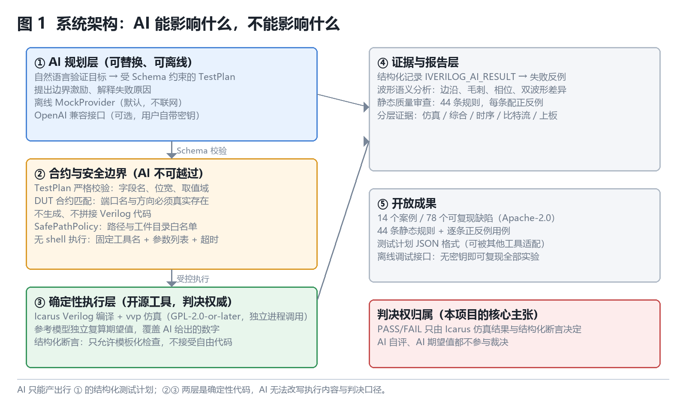
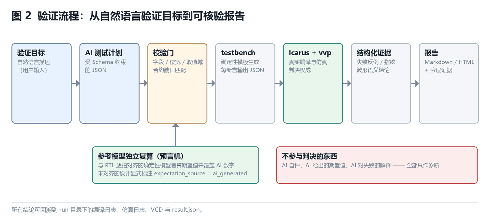
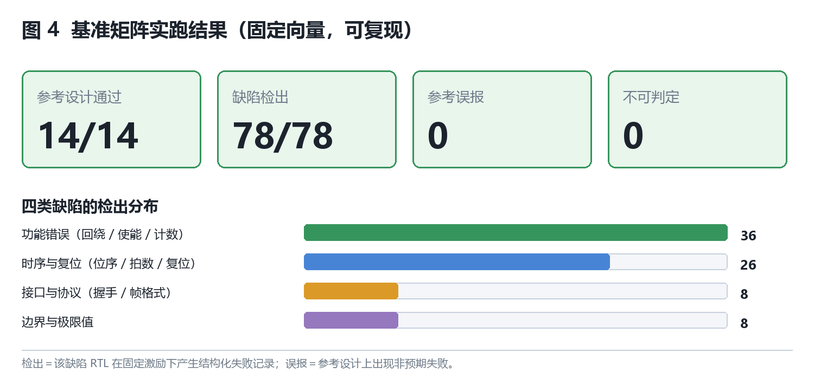
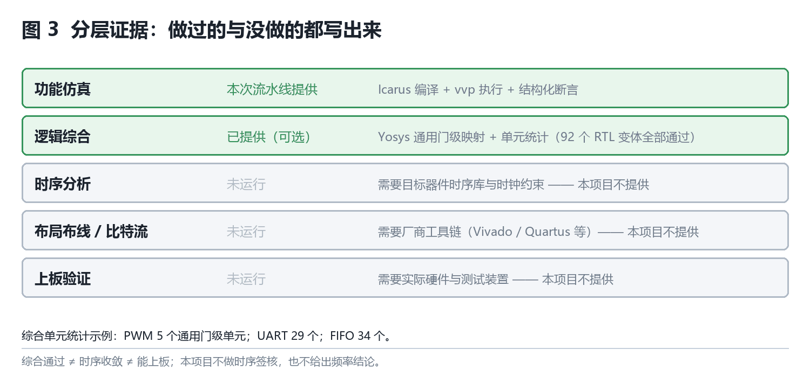

# AIC·AI+开源技术报告

> **团队名称**：（报名系统内填写）
> **团队编号**：（报名系统内填写）
> **作品名称**：Icarus 智测
> **参赛方向**：（二）AI 开发工具与开源协作
> **日期**：2026 年 月 日

> **说明**：本文按《AIC·AI+开源技术报告参考大纲》九节组织，正文控制在 15 页以内。
> 正文中的每一项数字都可在随附仓库中复现，复现命令见 §9 附录。文中不含学校名称、
> 校徽与指导教师信息（按竞赛规则第三条第（九）款）。

---

## 一、作品概述

### 1.1 背景与问题

围绕 Icarus Verilog 做验证的人，几乎都会卡在同一处：写得出 RTL，写不动测试台。

我们在自己的数字电路学习与项目实践中反复遇到三个具体问题：

**（1）测试台的门槛高于设计本身。** 一个 30 行的模十计数器，要覆盖复位、使能保持、
回绕三类行为，手写测试台通常需要 80 行以上，而且每换一个设计就要重写一遍。初学者
的常见结果是"RTL 写完了，但只做了肉眼检查"。

**（2）"AI 说验证过了"无法核验。** 通用大模型可以直接生成 testbench，但它同时会生成
**期望值**——而期望值一旦是错的，错的期望值会把错误的设计判成"通过"，或者把正确的
设计判成"失败"。这不是假设：本项目在真实在线模型实验中就观测到过这类现象（详见
§5.3）。**让被考核的对象同时担任考官，是这套做法最根本的缺陷。**

**（3）现有工具链缺一段自动化。** Icarus Verilog 是成熟、可靠、完全开源且可脚本化的
仿真器，它的定位是"给定 testbench，给出结果"。从"我想验证什么"到"可执行的
testbench"这一段，目前没有开源工具覆盖。

### 1.2 目标、参赛方向与作品形态

**参赛方向**：（二）AI 开发工具与开源协作。

**作品形态**：命令行工具 + 网页应用 + 可复用基准集与规则包。

**核心功能**：把自然语言的验证目标，转换为**受严格约束**的结构化测试计划，再由确定性
代码生成 testbench，交给 Icarus Verilog 真实编译与仿真，最后产出可追溯的证据与报告。

一句话概括本项目的分工主张：**AI 提出测试假设，开源仿真器作出判决。**

### 1.3 核心亮点

1. **AI 不参与判分。** PASS/FAIL 只由 Icarus 的编译/仿真结果与结构化断言决定。AI 给出的
   期望值会被独立的确定性参考模型复算并覆盖；两者不一致时，AI 的数字只作为一项诊断
   指标记录，不影响结论。
2. **15 个案例、80 个可复现缺陷，固定矩阵实跑 83/83 检出、0 误报、0 不可判定。**
   每个缺陷都有独立根因、专门的边界 testbench 与实跑证据（§5.2）。
3. **证据分层，并且把"没做的"写出来。** 报告用一张表显式区分"功能仿真 / 逻辑综合 /
   时序分析 / 布局布线 / 上板验证"五层，未做的三行标"未运行"，避免把"仿真通过"或
   "综合通过"误读为"能上板"（§5.5，图 3）。
4. **离线可完整复现。** 仓库自带离线调试模型服务（只监听回环地址、不需要密钥、不联网），
   因此评委可以在无凭据环境下跑通全部流程与实验。

---

## 二、需求分析与总体方案

### 2.1 需求分析

| 现有做法 | 主要痛点 | 需求优先级 |
|---|---|---|
| 手写 testbench | 工作量大、边界易漏、换设计即重写 | 覆盖度 |
| 通用大模型直接写 testbench | 期望值不可信；无法离线复核；结论不可追溯 | **可信度** |
| 商业仿真器的 AI 助手 | 闭源、需授权、无法审计判决路径 | 可信度 |

我们的优先级排序是 **可信度 > 覆盖度 > 效率**：一个"看起来自动化了但结论不可信"的
工具，在验证场景里比没有工具更危险。

### 2.2 总体方案



系统分四层，关键设计是**把 AI 关在第一层里**：

- **① AI 规划层（可替换）**：只输出结构化 JSON 测试计划。离线时使用按 DUT contract 生成的
  确定性规则计划（网页默认、进程内，另有一个回环 HTTP 调试接口），需要真实模型能力时接任意
  OpenAI 兼容接口——**离线规则引擎的结果不作为 AI 效果依据**。
- **② 合约与安全边界（AI 不可越过）**：测试计划必须通过严格的字段/位宽/取值域校验，
  并与显式 DUT 合约的端口逐一对齐；系统**不生成、不拼接 Verilog 代码**，只做受控模板
  填充；路径走白名单策略；执行不使用 shell，只以固定工具名 + 参数列表启动进程。
- **③ 确定性执行层**：Icarus 编译 + vvp 仿真作为判决权威；参考模型独立复算期望值。
- **④ 证据与报告层**：结构化记录、波形语义分析、静态质量审查、分层证据表。



### 2.3 可行性与成本

- **算力**：不需要 GPU，不需要训练模型。全部实验在本机 CPU 上完成。
- **软件**：全部依赖开源且免费（Icarus Verilog、Python、pydantic、Streamlit；可选的
  Yosys 综合层有 WASM 版本，离线可跑）。
- **时间**：单案例的"生成计划 → 生成 testbench → 编译 → 仿真 → 出报告"在秒级完成；
  完整的 15 案例 + 80 缺陷基准矩阵在分钟级完成。
- **数据**：不需要外部数据集；基准集由团队自行编写并逐项实跑验证。

---

## 三、AI 技术与开源及第三方资源选择

### 3.1 AI 技术的作用

AI 在本项目中承担三件事：

1. **把自然语言验证目标转成结构化测试计划**（TestPlan JSON）：确定要激励哪些端口、
   在什么顺序下覆盖哪些边界、每步期望什么。
2. **提出边界激励**：如 FIFO 写满、计数器回绕、序列重叠检测等容易漏掉的场景。
3. **解释失败原因**：把"第 5 拍 `count` 期望 3 实际 4"翻译成可读的因果描述。

**为什么需要 AI**：边界条件的枚举空间大且依赖设计语义，人工穷举成本高；这正是生成式
模型擅长的"根据语义提出候选假设"。

**如何验证 AI 输出**（这是本项目的核心工程内容）：

| 门 | 机制 | 拦截什么 |
|---|---|---|
| 第一门 | 严格 JSON Schema 校验（字段名、类型、位宽、取值域） | 格式错误、杜撰字段、越界取值 |
| 第二门 | DUT 合约匹配（端口名与方向必须真实存在） | 模型杜撰端口别名（如把 `enable` 写成 `en`） |
| 第三门 | 确定性参考模型复算并**覆盖** AI 期望值 | **AI 写错期望值导致假通过或假失败** |
| 第四门 | 结构化断言只允许模板化检查 | 模型注入自由 Verilog/SVA 代码 |

第三门是决定性的。内置案例的参考模型都已与参考 RTL **逐拍对齐**（15/15，多个随机
种子零差异），因此可以直接用模型复算值作为权威期望值。

### 3.2 开源及第三方资源选择

完整的名称、版本、来源、许可证、使用方式、关键义务与自研边界的逐项清单，见随报告
提交的《开源及第三方资源使用清单》（附件）。选型依据摘要：

| 资源 | 选它的理由 | 许可证 | 使用方式 |
|---|---|---|---|
| **Icarus Verilog** | 唯一成熟、完全开源、可脚本化、支持 Verilog-2001/-2012 的仿真器 | GPL-2.0-or-later | 独立进程调用，**不分发**；作为判决权威 |
| **Yosys / YoWASP** | 开源综合工具；WASM 版本可完全离线运行 | ISC | 独立进程调用，**不分发**；提供可选的分层证据 |
| **pydantic** | 提供严格的 Schema 校验，是把 AI 输出关进笼子的关键依赖 | MIT | 库依赖 |
| **Streamlit** | 零前端成本的单页演示，使评委可在浏览器里直接复现流程 | Apache-2.0 | 库依赖（可选） |
| **GTKWave** | 可选的人工波形复核 | GPL-2.0-or-later | 独立进程调用，**核心流程不依赖** |

### 3.3 自主开发与权利边界

| 类别 | 内容 |
|---|---|
| **第三方开源提供** | 仿真引擎（Icarus）、综合引擎（Yosys）、Schema 校验库（pydantic）、页面容器（Streamlit）。均为独立进程调用或库依赖，未修改、未分发其代码 |
| **通用 AI 工具完成** | 辅助编写部分 Python 模块、Verilog 测试台与文档草稿；生成内容**不主张为团队自主知识产权**，且其正确性一律由团队的编译、仿真与测试逐项验证 |
| **团队自主设计/开发/验证** | 测试计划 JSON 格式与校验规则；确定性 testbench 生成器；参考模型与逐拍对齐方法；结构化断言模板；基准集（15 案例 / 80 缺陷）与其边界 testbench；44 条静态规则及逐条正反例；波形语义分析（边沿/毛刺/相位/差异）；分层证据层；行为级对比；安全边界（路径策略、无 shell 执行、超时与输出上限）；全部中文文档与实验记录 |

### 3.4 融合方式：为什么不是"简单调用接口"

三点区别，每一点都有对应的实现与验证：

1. **AI 输出必须穿过确定性边界才能执行。** 不是"把模型输出贴进文件"，而是"模型输出
   必须通过 Schema 与合约双重校验，再由确定性代码生成 testbench"。模型从不接触
   Verilog 语法层，因此**结构上不可能**注入代码、命令或路径。
2. **开源仿真器是判决权威，AI 只是假设提出者。** 项目把"提出"与"裁决"分成两个可分别
   审计的部分：模型出 TestPlan，Icarus 出结论。这样即使模型完全不可靠，工具仍然可用
   （退化为"人工设计激励 + 真实仿真裁决"）。
3. **参考模型独立复算，堵住"写错期望值"这条路。** 这是同类工具普遍缺失的一环，也是
   本项目在真实模型实验中观测到问题之后专门补上的一环。

---

## 四、设计与实现过程

### 4.1 核心功能与流程

| 功能 | 输入 → 输出 |
|---|---|
| 测试计划生成与校验 | 自然语言目标 + DUT 合约 → 通过 Schema 校验的 TestPlan |
| 确定性 testbench 生成 | TestPlan + 合约 → Verilog-2001 testbench（每条断言输出一行结构化 JSON） |
| 执行与取证 | testbench + RTL → 编译/仿真日志、结构化记录、失败反例、VCD |
| 权威预言机 | TestPlan + 合约 → 参考模型复算的期望值（覆盖 AI 数字） |
| 结构化断言 | 受限模板（信号相等/稳定/永不置高） → 通过/失败记录 |
| 波形语义分析 | VCD → 边沿统计、毛刺判定、相位偏差、双波形差异、失败时间窗 |
| 静态质量审查 | RTL 源码 → 44 条规则命中 + 质量评分 + Markdown 报告 |
| 分层证据 | RTL 源码 + Yosys → 综合状态、单元统计、五层证据表 |
| 行为级对比 | 两份 RTL + 同一 TestPlan → 逐检查项差异 + 波形差异 |

### 4.2 关键实现

**（1）确定性 testbench 生成器。** 生成器不解析也不拼接模型提供的任何文本，只把
已通过校验的标量数据填入固定模板。每个断言都输出一行 `IVERILOG_AI_RESULT {json}`，
由执行器的严格解析器消费。这样"AI 生成的内容"与"可执行代码"在结构上被彻底分离。

**（2）权威预言机门控。** 只有**与 RTL 逐拍对齐**的参考模型才能覆盖期望值；未对齐的
设计会返回空字典，调用方回退为 AI 期望值并如实标注 `expectation_source="ai_generated"`。
这条门控是必要的：模型一旦与 RTL 差一拍，就会把"参考设计通过"改写成"参考设计失败"，
比没有预言机更糟。放宽这个集合的方法只有一个——让模型逐拍对齐（"对齐一个、加入一个"）。

**（3）IEEE 1364 非阻塞赋值语义对齐。** 对齐过程中共发现并修掉 8 个模型错误，其中
三个属于同一类根因：**同一时刻对同一变量的非阻塞赋值，其右侧读到的是旧值**。
例如 UART 发送器写 `bit_idx <= bit_idx + 1` 之后同拍读 `frame[bit_idx+1]`，用的是
**旧**的 `bit_idx`——模型若用新值取位，输出就会整体错开一拍。SPI 主机的 `sclk`/`mosi`、
去抖模块的 `key_state` 都栽在同一处。这类问题只有逐拍对照才能发现，肉眼看波形很容易
误判成"差不多对"。

**（4）路径与进程安全。** 所有外部进程都以固定工具名 + 参数列表启动，**不经过 shell**；
输入与工件路径走白名单策略；每个进程带超时与输出上限；不自动覆盖原始 RTL。

**（5）噪声校准作为交付物的一部分。** 静态规则初版对仓库内 84 个 RTL 文件报出 317 条
命中，其中包含会严重误导报告的错误。我们没有直接把规则数当成果，而是逐条核实、修掉
误报（详见 §5.4），并把校准过程写进文档。波形毛刺判据同样经历了三轮校准才做到不误报。

### 4.3 团队分工与过程记录

> **本节按竞赛规则第三条第（九）款做匿名处理**：不出现学校名称、校徽与指导教师信息。

- **成员分工**：成员 A 负责 AI 规划层与 Provider 适配、测试计划 Schema 与校验；成员 B
  负责确定性执行层、安全边界与证据链；成员 C 负责基准集与缺陷设计、参考模型对齐与
  文档。三人共同完成网页演示与实验设计。
- **过程记录**：项目以版本迭代方式推进，仓库提交历史即为过程记录（每个阶段有明确的
  提交信息与验证结论）。
- **生成式 AI 与智能体工具的使用**：用于辅助编写部分 Python 模块、Verilog 测试台与
  文档草稿。**团队的审核、修改与验证工作**包括：逐文件人工审核；以本机 Icarus 真实
  编译与仿真结果作为功能结论的唯一依据；以 510 项自动化测试作为回归门禁；对每个缺陷
  变体单独复现失败证据；核对每条技术陈述与实验产物的一致性，删除与实现不符的表述。
  对所用模型/平台的许可与服务条款：项目默认不请求任何网络服务，仅在用户显式配置
  密钥并打开网络开关后才调用，且不在仓库内保存凭据。
- **AI 生成内容的权利核查**：仓库内无第三方复制代码；未使用第三方图片、音视频或数据集；
  报告插图由团队用自有脚本（`scripts/make_report_figures.py`）程序化生成。

---

## 五、成果展示与效果验证

### 5.1 成果展示

作品提供命令行与网页两个入口。网页包含：AI 接口设置、测试计划查看、执行流水线、
失败反例、波形语义结论、分层证据、静态质量审查、自定义 RTL 导入与行为级对比。
页面顶部固定展示"实证状态"面板（案例数、缺陷数、规则数、测试数、已对齐模型数），
全部数字由页面实时读取仓库文件现算。

复现方式见 §9 附录；网页入口：`streamlit run ui/app.py`。

### 5.2 验证方法

| 方法 | 做法 | 能回答的问题 |
|---|---|---|
| **固定矩阵基准** | 15 个参考设计 + 83 个缺陷变体，逐个跑同一固定激励 | 能不能检出已知缺陷，会不会误报 |
| **逐拍对齐** | 同一组向量同时喂给参考模型与 RTL，多随机种子逐拍比较 | 权威期望值本身是否正确 |
| **真实模型公平实验** | 固定 / 随机 / 离线AI / 在线AI 四种策略跑同一批案例 | AI 到底带来多少提升，代价是什么 |
| **负例验证** | 构造"必须失败"的输入（不可综合 RTL、语义等价重写、已知缺陷） | 判据是否真的在起作用，而不是永远说"通过" |
| **自动化回归** | 510 项测试（含实跑 Icarus 的端到端用例） | 改动是否破坏既有结论 |

### 5.3 验证结果



**（1）固定矩阵基准（可一键复现）**

| 指标 | 结果 |
|---|---|
| 参考设计通过 | **15 / 15** |
| 缺陷检出 | **83 / 83**（检出率 100%） |
| 参考误报 | **0** |
| 不可判定 | **0** |

**（2）参考模型对齐**：15/15 个内置案例的参考模型与 RTL 在 4 个确定性随机种子上逐拍
零差异，因此全部可以作为权威预言机；建模覆盖与权威集合完全一致（有测试断言防止放宽）。

**（3）真实在线模型实验**（当前口径：13 案例 / 67 缺陷 × 每案例 **10 次**重复 × **2 个模型**，
每个模型 130 次真实请求；详见 `docs/experiment/model_comparison_2026-09-12.md`。
下表给出**单轮平均检出率**——与只跑 1 轮的基线可比；括号内为 10 轮累计并集）：

| 策略 | 单轮检出率 | 累计并集 | 说明 |
|---|---:|---:|---|
| 固定向量（1 轮） | 83.6% | 56/67 | 人工设计的固定激励 |
| 随机向量（1 轮） | 76.1% | 51/67 | 同种子可复现的随机激励 |
| 离线 AI 规划（1 轮） | 76.1% | 51/67 | 确定性离线模型，用于验证流程而非能力 |
| **在线 AI（flash，10 轮）** | **85.8%** | 65/67（97.0%） | 比固定向量高 2.2、比离线基线高 9.7 个百分点 |
| **在线 AI（v4-pro，10 轮）** | **87.8%** | 64/67（95.5%） | 单轮更稳，但累计并集略低；生成慢 3.4 倍 |

该轮**参考误报为 0**（125 次参考设计运行无一次硬失败）。同时公开的**未达预期项**：
2 个缺陷未被检出，原因都已定位且**都不是模型能力问题**，而是激励相位/观测点
（一个需要在两个时钟沿之间采样异步复位断言，一个需要复位前观测）——这两条在手写边界
testbench 的固定矩阵里都能检出；另有 5 次请求（3.8%）的计划被严格校验拒绝，两次尝试
同一根因（给 `signal_implies` 多写了 `signal` 字段），按"不可判定"如实记录、不伪造结果。
**该根因已在 2026-09 复核中更正**：提示词自己就把 `signal` 列进了该模板的字段表，模型只是
照做；而且该模板当时无论如何都通不过校验。缺陷在本项目一侧，已修复并加了"提示词字段表 ==
校验器字段表"的回归门禁（见变更记录）——报告正文按修复后的事实陈述，不把提示词缺陷
记成模型能力问题。
token 消耗：flash 1,229,171、v4-pro 1,239,161（按请求去重），生成耗时中位 29.4 秒 vs
103.8 秒。**两个模型的漏检集合几乎不重叠**（交集仅 1 个缺陷，并集 66/67），说明多模型的收益来自互补，而不是选最强的那个。

**（4）负例验证**（证明判据不是"永远通过"）：

- 不可综合的 RTL（变量上界的 `while` 循环）→ 综合层报 **失败**；
- 语义等价但写法不同的重写（多出一个内部辅助信号）→ 行为对比判 **一致**；
- 已知缺陷（极性反转、计数差一）→ 行为对比判 **不同**，并定位到具体信号与拍。

**（5）尚达到不了的目标（如实说明）**：不做时序签核；不做代码覆盖率；不做 CDC 形式化；
自定义 RTL 不等同于不可信代码安全沙箱；参考模型只覆盖内置案例。

### 5.4 噪声校准记录（为什么这部分也算成果）

**静态规则**：初版 9 条规则、对仓库 84 个 RTL 文件报出 317 条命中，含大量误报。
逐条核实后修掉：`division-operator` 把注释结尾 `*/` 当成除法（84/84 全命中）、
`inferred-latch` 把合法写法误判为锁存器（15 条 error 级误报）、`missing-timescale`
因注释剥离而全命中、时钟/复位名只匹配前缀（`rst*`）导致实际命名 `rst_n` 从不命中。
校准后：44 条规则、163 条命中、**0 条 error 级误报**。

**波形毛刺判据**：初版"窗口内翻转多次即不稳定"在时钟与计数器上全面误报；第二版
"短于全局中位数 1/3"仍把 `busy` 信号的正常窄脉冲报成毛刺；第三版改为"全局基线 +
连续 ≥3 个异常间隔 + 复位沿不参与统计"后，时钟、计数器、脉冲、双峰节奏全部不再误报，
而真实连续快翻仍能命中。

我们把这两段过程写进文档，因为"规则命中数"本身不是成果，**"命中里有多少是真的"**才是。

### 5.5 分层证据



在同一份 RTL 上按需追加 Yosys 综合：98 个 RTL 变体（15 参考 + 83 缺陷）全部可综合，
并给出通用门级单元统计（如 PWM 5 个单元、UART 29 个、FIFO 34 个）。
复现命令：`python scripts/run_synthesis_matrix.py`。

**这张表刻意把"没做的"写出来**：时序分析、布局布线/比特流、上板验证三行标"未运行"。
这样读者不会把"综合通过"误读为"能上板"。

一个值得记录的实测结论：`#5 q <= d;` 这类延时**不会**让 Yosys 报错——它被静默忽略。
所以"综合通过"也不能反过来当作"这段代码的时序语义被正确实现了"的证据。

---

## 六、创新性与开放价值

### 6.1 创新性

与"让大模型直接写 testbench"的常见方案相比，本项目的实质改进有三条：

1. **把"AI 自评"从判决链里彻底移除。** 判决权归开源仿真器，AI 只提出假设；AI 给出的
   期望值会被确定性参考模型复算覆盖。这不是提示词技巧，而是架构上的分工。
2. **证据分层与负向声明。** 主动写出未做的证据层级（时序/比特流/上板），并把"综合通过
   ≠ 时序收敛 ≠ 能上板"作为固定免责声明写入报告与网页。
3. **噪声校准与失败公开成为交付物的一部分。** 静态规则与波形分析都公开了误报校准过程；
   在线模型实验公开了 9 个未检出缺陷及逐条原因，而不是只报最佳成绩。

### 6.2 开放成果

| 成果 | 内容 | 许可 |
|---|---|---|
| 代码仓库 | 完整工具链（AI 规划层、执行层、证据层、网页） | Apache-2.0 |
| 基准集 | 15 个案例 / 83 个缺陷变体 + 边界 testbench + 清单 | Apache-2.0 |
| 静态规则包 | 44 条规则（含逐条正反例用例） | Apache-2.0 |
| 验证规则包 | 按案例组织的模型约束规则（含来源与提炼原则） | Apache-2.0 |
| 测试计划格式 | 结构化 JSON 合约，可被其他工具或仿真器适配 | Apache-2.0 |
| 中文文档 | 架构、规则清单、波形判据、对齐方法、分层证据、行为对比等 | Apache-2.0 |

### 6.3 社区贡献与复用

**如实说明**：目前**尚无**向 Icarus Verilog 上游提交的 Issue 或 Pull Request；本项目是
围绕上游的非官方扩展，与上游维护者无隶属或背书关系，也不修改、不分发上游代码。

可复用的方式（不需要上游改动）：

- **基准集可直接被其他 Verilog 项目使用**：83 个缺陷变体覆盖计数器、状态机、FIFO、
  UART、SPI、握手、去抖、PWM、复位同步、约翰逊计数器、边沿检测等常见模块，可用于
  评测其他验证工具或教学。
- **测试计划 JSON 格式与 "AI 提出、工具裁决" 的分工可迁移**到其他开源仿真器
  （Verilator、GHDL 等），换掉执行层即可。
- **离线调试接口**（`python -m iverilog_ai.ai.debug_server`）让任何人都能在无密钥、
  不联网的环境下复现全部流程与实验。

### 6.4 维护计划

后续迭代方向：继续扩展案例与缺陷类型；把更多参考模型纳入逐拍对齐；扩展综合层
（如仅做资源对比，仍不承诺时序）；为其他开源仿真器提供执行层适配；补充上游贡献计划
（把基准集作为独立评测资源向上游社区介绍）。问题反馈通过仓库 Issue 入口。

---

## 七、合规、安全与风险说明

### 7.1 开源及第三方许可合规

- **GPL-2.0-or-later 工具（Icarus、GTKWave）**：以独立进程调用，不修改、不复制、
  不重新分发、不链接，因此不触发源码提供义务；不声称上游背书。仓库不含其任何源码或
  二进制。
- **ISC 工具（Yosys / YoWASP）**：同样以独立进程调用，保留版权与许可声明。
- **MIT / BSD / Apache-2.0 / PSF 依赖**：保留版权与许可声明，列表见附件清单与
  `THIRD_PARTY.md`。
- **"公开可访问 ≠ 有再利用授权"**：本项目未使用任何仅"可访问"但无明确许可的第三方
  数据集、图片或音视频素材；报告插图由自有脚本程序化生成。

### 7.2 数据、权利与隐私

**未使用任何第三方数据集；不收集用户数据；不涉及个人信息。** 用户上传的自定义 RTL
只在本机处理，不自动外发。发往模型服务的内容限于设计名、验证目标、DUT 合约摘要与
脱敏后的失败字段；**不上传 RTL 源码、文件路径、命令或密钥**。

### 7.3 AI 输出、知识产权与内容安全

| 风险 | 应对措施 |
|---|---|
| 模型幻觉（杜撰端口、位宽、期望值） | 四重门控：Schema 校验 → 合约匹配 → 参考模型复算覆盖 → 仅允许模板化断言 |
| 提示注入 / 代码注入 | 模型输出不进入命令、路径或代码；生成器不做字符串拼接；执行不经 shell |
| 错误的"通过"结论 | 判决权归 Icarus；参考设计出现失败时单独计为误报指标，不计入检出 |
| 凭据泄露 | 默认离线、无密钥；密钥只存在于进程内存或页面会话；`.gitignore` 排除 `.env`；仓库检索无密钥 |
| AI 生成内容的权利 | 不主张为团队自主知识产权；已说明参与环节与团队验证工作 |

### 7.4 技术限制与不宜使用的场景

- 仿真通过 **不等于** 可综合；综合通过 **不等于** 时序收敛或能上板；
- 本项目 **不做** 时序签核、**不做** 代码覆盖率、**不做** CDC 形式化验证；
- 静态规则是**保守的 lint 式检查**，不做完整语法树解析，对宏展开与 `generate` 内动态
  结构判断能力有限，策略是"宁可漏报也不误报"；
- 波形分析只覆盖 VCD 中 dump 出来的信号；
- 参考模型只覆盖内置案例；自定义设计的期望值来源只能是 AI 或人工，可信度更低（工具会
  显式标注来源）；
- 自定义 RTL 不等同于不可信代码安全沙箱，请勿用于执行来路不明的设计。

---

## 八、总结与展望

### 8.1 项目总结

本项目围绕 Icarus Verilog 构建了一套"AI 提出、开源工具裁决"的验证工具链，完成了：

- 可运行的命令行与网页工具；
- 15 个案例、83 个可复现缺陷的基准集，实跑 **83/83 检出、0 误报、0 不可判定**；
- 15/15 个参考模型的逐拍对齐（权威期望值）；
- 44 条静态规则（含逐条正反例与噪声校准记录）；
- 波形语义分析、分层证据、行为级对比三项深度能力；
- 510 项自动化测试作为回归门禁；
- 离线可完整复现的调试接口。

**主要价值**：把"AI 辅助验证"从"相信模型"变成"用开源工具裁决模型提出的假设"，并把这个
过程中的失败、误报与边界如实公开。

**未完成事项**：时序与上板证据层（需要器件库与硬件，超出本周期条件）；上游社区贡献；
更广泛的第三方工具适配。

**团队收获**：理解了 IEEE 1364 非阻塞赋值的实际影响（8 个模型错误中有 3 个源于此）；
学会了把"工具报出的数字"与"数字里有多少是真的"分开评估；体会到"如实说明没做什么"
比"多报一个指标"更能提高可信度。

### 8.2 后续计划

1. 继续扩展案例与缺陷类型，优先补充协议类与跨时钟域类；
2. 把参考模型对齐方法固化为可复用的"对齐一个、加入一个"流程；
3. 为其他开源仿真器提供执行层适配，使基准集与测试计划格式可跨工具复用；
4. 完善文档与教程，降低他人复用基准集的门槛；
5. 在权利与合规边界清晰的前提下，向上游社区介绍本项目与基准集。

---

## 九、附录

### 9.1 开源及第三方资源使用清单

见随报告提交的附件《开源及第三方资源使用清单》（仓库内：
`docs/competition/opensource_resource_list.md`），已按官方参考表列序编制。

### 9.2 仓库链接与运行说明

```powershell
# 1. 安装（仅需 Python 3.11+ 与 Icarus Verilog）
python -m pip install -e .

# 2. 命令行快速验证（无需任何密钥、无需联网）
python -m iverilog_ai run `
  --rtl rtl/mod10_counter.v `
  --testbench tb/tb_mod10_counter.v `
  --top tb_mod10_counter `
  --iverilog D:\iverilog\bin\iverilog.exe `
  --vvp D:\iverilog\bin\vvp.exe

# 3. 一键复现基准矩阵结论（15 参考 + 83 缺陷）
python scripts/run_benchmark_matrix.py

# 4. 启动网页演示
streamlit run ui/app.py

# 5. 无密钥、不联网地跑通完整 AI 流程
python -m iverilog_ai.ai.debug_server      # 另开一个终端
```

推荐给评委的**五分钟复现路径**：跑第 3 步看基准矩阵结论 → 跑第 5 步 + 网页看
"AI 生成计划 → 受控生成 testbench → Icarus 裁决 → 报告"的完整链路 → 在网页上
切换到"自定义 RTL"体验导入与行为级对比。

### 9.3 测试记录与实验记录

| 记录 | 位置 |
|---|---|
| 基准矩阵逐项结果 | 仓库 `.iverilog-ai/benchmark-matrix/` |
| 固定/随机/AI 策略公平实验 | `docs/experiment/` |
| 在线真实模型实验（含未检出缺陷逐条原因） | `docs/experiment/online_model_experiment_2026-09-10.md` |
| 参考模型逐拍对齐方法与踩坑记录 | `docs/reference_model_alignment.md` |
| 静态规则清单与噪声校准 | `docs/static_rules.md` |
| 波形分析判据与三轮校准 | `docs/vcd_analysis.md` |
| 分层证据口径与实测 | `docs/layered_evidence.md` |
| 行为级对比判据与实测 | `docs/behavior_compare.md` |

### 9.4 插图说明

本报告插图（图 1–图 4）由团队自有脚本 `scripts/make_report_figures.py` 使用 Pillow
程序化生成，不包含任何第三方图片素材；脚本可重跑，图与仓库数据保持一致。

### 9.5 参考文献

1. IEEE Std 1364-2005, *IEEE Standard for Verilog Hardware Description Language*.
2. Icarus Verilog 项目文档与用户指南，<https://steveicarus.github.io/iverilog/>。
3. Yosys Open SYnthesis Suite 文档，<https://yosyshq.readthedocs.io/>。
4. lowRISC Verilog Coding Style Guide（仅参考公开文档中的编码与复位约定，未复制代码）。
5. cocotb 文档（验证工程实践参考，未复制代码）。
