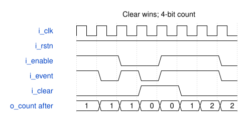

# event_accumulator 模块规范

> RTL: `targets/event_accumulator/A/event_accumulator.v`

## 1. 模块目的

未提供模块目的。

## 2. 参数

| 参数 | 默认值 | 说明 |
| --- | --- | --- |
| — | — | 本模块没有可配置参数。 |

## 3. 时钟与复位

- 时钟：`{"signal": "i_clk", "period_ns": 10, "edge": "posedge"}`
- 复位：`{"signal": "i_rstn", "active_level": 0, "synchronous": false, "assert_cycles": 2}`

## 4. 接口信号规范

| 信号 | 方向 | 位宽 | 时钟域 | 语义角色 | 描述 |
| --- | --- | --- | --- | --- | --- |
| `i_clk` | input | 1 | 未声明 | clock | i_clk |
| `i_rstn` | input | 1 | 未声明 | reset | i_rstn |
| `i_enable` | input | 1 | 未声明 | input_data_or_control | i_enable |
| `i_event` | input | 1 | 未声明 | input_data_or_control | i_event |
| `i_clear` | input | 1 | 未声明 | input_data_or_control | i_clear |
| `o_count` | output | 4 | 未声明 | output_data_or_control | o_count |

## 5. 周期行为与延迟

- # event_accumulator 正确行为规格 / Enabled event accumulator

固定 4 位事件累计器，适合本地事件统计；结果为自最近复位或清除以来被接受事件数的模 16 值。

| 端口 | 方向 | 位宽 | 含义 |
| --- | --- | --- | --- |
| i_clk | input | 1 | 上升沿采样时钟 |
| i_rstn | input | 1 | 异步低有效复位 |
| i_enable | input | 1 | 当拍事件累计许可 |
| i_event | input | 1 | 当拍存在一个事件 |
| i_clear | input | 1 | 同步清除计数，独立于 enable |
| o_count | output | 4 | 无符号累计结果，0–15 |

## 逐拍规则 / Edge semantics

优先级依次为异步复位、同步 clear、接受事件、保持。

1. 异步复位立即使 `o_count=0`。
2. 未复位且 `i_clear=1` 的上升沿，`o_count=0`，不论 `i_enable` 是 0 还是 1；当拍即使同时有事件也不累计。
3. 未复位、`i_clear=0` 且 `i_enable=1, i_event=1` 时，接受当拍一个事件。after 输出等于以前累计数加 1 模 16，即 15 的后继是 0。
4. 其他输入组合保持计数。事件高电平持续 N 拍且每拍均获许可，就计入 N 个事件；不做只在上升变化时计数的边沿检测。
5. 清除解除后从 0 继续累计，不保留清除前数量。

The counter records accepted event edges modulo 16. Clear is synchronous, independent of enable, and takes priority over an event. A sustained enabled event counts once on each rising clock edge; this module is not an event-edge detector.

## 正常时序例 / Correct timing example

复位已释放，从 0 开始。输出均为该沿 after 值。

| 沿 | i_enable | i_event | i_clear | o_count |
| --- | --- | --- | --- | --- |
| E0 | 1 | 1 | 0 | 1 |
| E1 | 1 | 0 | 0 | 1 |
| E2 | 0 | 1 | 0 | 1 |
| E3 | 0 | 0 | 1 | 0 |
| E4 | 1 | 1 | 1 | 0 |
| E5 | 1 | 1 | 0 | 1 |
| E6 | 1 | 1 | 0 | 2 |
| E7 | 0 | 0 | 0 | 2 |

## 协议操作 / Protocol operations

合理覆盖许可/事件的四种组合、连续累计、暂停保持、清除与其他控制同时出现、复位后重新累计及模 16 环回。输入计划自主选择，正常语义不预设任何缺陷名称或目标。

## 6. WaveDrom 时序图

### 正确逐拍时序

after 值与规格时序表一致。

- WaveJSON：[event_accumulator_normal-operation.json5](waveforms/event_accumulator_normal-operation.json5)

## 7. 边界、反压与错误

- 低有效异步复位；控制优先级；未指定输入保持；已知合法位宽。

## 8. CDC 与综合约束

- ## 时钟、复位与采样 / Clock, reset and sampling

- 无可配置参数；固定接口位宽。`i_clk` 周期 10 ns，所有同步操作在上升沿发生。
- `i_rstn` 为异步低有效复位。拉低后无需等待时钟，所有状态与输出归零。
- 每个独立 episode 开始时自动拉低复位并经过 2 个上升沿，再释放复位；前一 episode 的电路状态不延续。
- 新 episode 中 `i_rstn` 默认为 1，其余非时钟输入均为 0。一个 episode 内未重新指定的输入保持之前的值，不能把省略输入理解为自动归零。不得驱动自动时钟 `i_clk`。
- 输入在上升沿前稳定；每一刺激拍在该上升沿的非阻塞更新完成后采集 **全部真实输出**（after）。不使用 before 采样，不把多拍向量只采最后一拍。
- 每任务实际执行的所有 episode 共用 **24 个刺激拍**上限，每次提案最多 **12 个输入向量/段**。自动起始复位不计刺激拍；计划内显式复位拍计入。剩余预算以当前状态为准，不能依靠重新复位刷新任务预算。
- 输入均为已知、合法位宽的整数或等价已知二进制值。输出是被测模块真实端口，不要求提案自行给出 expected。

Each episode starts from a fresh asynchronous reset, followed by two asserted rising edges. Inputs omitted within an episode retain their previous values; fresh business defaults are zero. Sample all outputs after every rising edge. The entire task shares 24 stimulus cycles, with at most 12 input segments per proposal. Automatic reset does not replenish that shared stimulus budget.

## 9. 验证与验收

- 独立语义模型的逐拍机械对照、控制组合、数据或环回边界、复位。

## 10. 可追溯性

- 规格模块：`event_accumulator`
- RTL 路径：`targets/event_accumulator/A/event_accumulator.v`
- 交付要求：本文档、WaveJSON 和 SVG 必须与同一版本规格一同发布。
