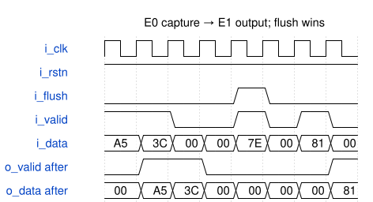

# valid_data_pipeline 模块规范

> RTL: `targets/valid_data_pipeline/A/valid_data_pipeline.v`

## 1. 模块目的

未提供模块目的。

## 2. 参数

| 参数 | 默认值 | 说明 |
| --- | --- | --- |
| — | — | 本模块没有可配置参数。 |

## 3. 时钟与复位

- 时钟：`{"signal": "i_clk", "period_ns": 10, "edge": "posedge"}`
- 复位：`{"signal": "i_rstn", "active_level": 0, "synchronous": false, "assert_cycles": 2}`

## 4. 接口信号规范

| 信号 | 方向 | 位宽 | 时钟域 | 语义角色 | 描述 |
| --- | --- | --- | --- | --- | --- |
| `i_clk` | input | 1 | 未声明 | clock | i_clk |
| `i_rstn` | input | 1 | 未声明 | reset | i_rstn |
| `i_flush` | input | 1 | 未声明 | input_data_or_control | i_flush |
| `i_valid` | input | 1 | 未声明 | input_data_or_control | i_valid |
| `i_data` | input | 8 | 未声明 | input_data_or_control | i_data |
| `o_valid` | output | 1 | 未声明 | output_data_or_control | o_valid |
| `o_data` | output | 8 | 未声明 | output_data_or_control | o_data |

## 5. 周期行为与延迟

- # valid_data_pipeline 正确行为规格 / Two-stage valid/data pipeline

固定 8 位两级寄存流水，连续输入可每拍接受一个数据，无 ready 和反压。

| 端口 | 方向 | 位宽 | 含义 |
| --- | --- | --- | --- |
| i_clk | input | 1 | 上升沿采样时钟 |
| i_rstn | input | 1 | 异步低有效复位 |
| i_flush | input | 1 | 当拍同步清空流水 |
| i_valid | input | 1 | 当拍输入数据有效 |
| i_data | input | 8 | 无符号输入数据，0–255 |
| o_valid | output | 1 | 当拍输出数据有效 |
| o_data | output | 8 | 有效输出数据；无效时固定为 0 |

## 逐拍规则 / Edge semantics

优先级依次为异步复位、同步 flush、正常流水。

1. 未复位且 `i_flush=0` 时，某数据在 E0 的上升沿以 `i_valid=1` 被第一级接受，在 **下一上升沿 E1** 经过第二级后输出，`o_valid=1` 且 `o_data` 等于 E0 的 `i_data`。这里“两级”指 E0 捕获和 E1 输出两个寄存采样沿；不是再等待两个额外周期。
2. E0 的 `i_valid=0` 表示空拍，E1 对应输出 `o_valid=0, o_data=0`。无效拍数据清零，不保持之前有效数据。
3. 连续有效输入连续输出，顺序不变；输出当拍的有效标志与数据必须来自同一输入拍。
4. `i_flush=1` 的上升沿，输出当拍即 `o_valid=0, o_data=0`，所有未交付数据被丢弃。当拍即使 `i_valid=1` 也不接受；解除 flush 后没有旧数据重新出现。
5. 异步复位同样立即清空两级与全部输出。释放复位后按新的输入重新开始；未接受新数据前输出仍为零。

A word accepted at E0 is emitted after E1. Invalid output cycles always carry zero data. Synchronous flush takes precedence over a valid input, clears both stages and the current outputs, and drops the input on that same edge. Reset is asynchronous and active low.

## 正常时序例 / Correct timing example

复位已释放；下表全部输出均为该沿 after 值。

| 沿 | i_flush | i_valid | i_data | o_valid | o_data |
| --- | --- | --- | --- | --- | --- |
| E0 | 0 | 1 | A5 | 0 | 00 |
| E1 | 0 | 1 | 3C | 1 | A5 |
| E2 | 0 | 0 | 00 | 1 | 3C |
| E3 | 0 | 0 | 00 | 0 | 00 |
| E4 | 1 | 1 | 7E | 0 | 00 |
| E5 | 0 | 0 | 00 | 0 | 00 |
| E6 | 0 | 1 | 81 | 0 | 00 |
| E7 | 0 | 0 | 00 | 1 | 81 |

## 协议操作 / Protocol operations

合理覆盖连续接受、有效/空拍交替、等待流水排空、清空时有/无在途数据、复位后的重新开始，以及 00/FF 和混合位数据。输入计划自主选择，不固定为某一组向量。

## 6. WaveDrom 时序图

### 正确逐拍时序

after 值与规格时序表一致。

- WaveJSON：[valid_data_pipeline_normal-operation.json5](waveforms/valid_data_pipeline_normal-operation.json5)

## 7. 边界、反压与错误

- 低有效异步复位；控制优先级；未指定输入保持；已知合法位宽。

## 8. CDC 与综合约束

- ## 时钟、复位与采样 / Clock, reset and sampling

- 无可配置参数；固定接口位宽。`i_clk` 周期 10 ns，所有同步操作在上升沿发生。
- `i_rstn` 为异步低有效复位。拉低后无需等待时钟，所有状态与输出归零。
- 每个独立 episode 开始时自动拉低复位并经过 2 个上升沿，再释放复位；前一 episode 的电路状态不延续。
- 新 episode 中 `i_rstn` 默认为 1，其余非时钟输入均为 0。一个 episode 内未重新指定的输入保持之前的值，不能把省略输入理解为自动归零。不得驱动自动时钟 `i_clk`。
- 输入在上升沿前稳定；每一刺激拍在该上升沿的非阻塞更新完成后采集 **全部真实输出**（after）。不使用 before 采样，不把多拍向量只采最后一拍。
- 每任务实际执行的所有 episode 共用 **24 个刺激拍**上限，每次提案最多 **12 个输入向量/段**。自动起始复位不计刺激拍；计划内显式复位拍计入。剩余预算以当前状态为准，不能依靠重新复位刷新任务预算。
- 输入均为已知、合法位宽的整数或等价已知二进制值。输出是被测模块真实端口，不要求提案自行给出 expected。

Each episode starts from a fresh asynchronous reset, followed by two asserted rising edges. Inputs omitted within an episode retain their previous values; fresh business defaults are zero. Sample all outputs after every rising edge. The entire task shares 24 stimulus cycles, with at most 12 input segments per proposal. Automatic reset does not replenish that shared stimulus budget.

## 9. 验证与验收

- 独立语义模型的逐拍机械对照、控制组合、数据或环回边界、复位。

## 10. 可追溯性

- 规格模块：`valid_data_pipeline`
- RTL 路径：`targets/valid_data_pipeline/A/valid_data_pipeline.v`
- 交付要求：本文档、WaveJSON 和 SVG 必须与同一版本规格一同发布。
